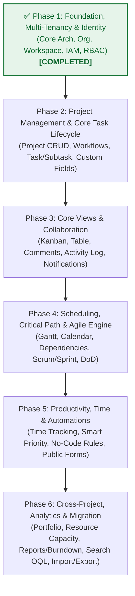

# OmniProject Core — Lộ trình Phát triển theo Giai đoạn (Development Phases Roadmap)

> **Mục tiêu:** Phân rã 24 phân hệ tính năng (107 sub-features) của OmniProject Core thành các Phase phát triển tuần tự từ **Nền tảng (Foundation)** đến **Nâng cao (Advanced)**, đảm bảo tính phụ thuộc dữ liệu (Data Dependency), khả năng kiểm thử độc lập (Independent Testability) và sẵn sàng chuyển hóa thành SRS & RTM để lập trình.

---

## 🧭 Ma trận Phụ thuộc & Nguyên tắc Sắp xếp (Architectural Principles)

Để đảm bảo hệ thống mở rộng tốt (Scalability), không bị đập đi làm lại schema (Efficiency), và kiến trúc rõ ràng cho team dev (Maintainability), thứ tự phát triển tuân thủ triệt để đồ thị phụ thuộc (DAG - Directed Acyclic Graph):

---

## 📌 Bảng Tổng hợp 6 Giai đoạn (Phases Breakdown)

| Phase | Tên Giai đoạn (Phase Name) | Trạng thái (Status) | Trọng tâm Nghiệp vụ | Phân hệ Tính năng (FR Modules) | Số Sub-features | Điều kiện Tiên quyết (Prerequisites) |
|---|---|---|---|---|---|---|
| **Phase 1** | **Foundation, Multi-Tenancy & IAM** | <mark>**✅ Đã hoàn thành (Completed)**</mark> | Hạ tầng kỹ thuật, Định danh, Tổ chức, Phân quyền RBAC, Multi-tenant isolation | - **FR-PRJ-000**: Core Architecture, NFRs & RBAC - **FR-ORG-001**: Workspace, Org & Billing - **FR-ORG-002**: IAM, Invites & User Groups | 10 sub-features + Core Specs | None (Khởi đầu) |
| **Phase 2** | **Project & Core Task Lifecycle** | 🔄 **Sắp triển khai (Next Up)** | Không gian dự án, Quản lý trạng thái luồng (Workflow), Thực thể Task, Subtask & Trường tùy biến | - **FR-PRJ-018**: Project Lifecycle & Templates - **FR-PRJ-002**: Dynamic Workflow & WIP Limits - **FR-PRJ-006**: Subtask Management - **FR-PRJ-004**: Dynamic Custom Fields (EAV) | 17 sub-features | Phase 1 |
| **Phase 3** | **Execution Views & Collaboration** | ⏳ Chờ xử lý (Pending) | Giao diện làm việc trực quan (Kanban/Table), Tương tác đội ngũ realtime, Thông báo nội bộ & Không gian cá nhân | - **FR-PRJ-001.1, 001.3**: Kanban & Table View - **FR-PRJ-005**: Task Collaboration (Rich-text, Attachments, Comments, Mentions) - **FR-PRJ-015**: Personal Space & My Tasks - **FR-PRJ-013**: In-app Notification Center | 16 sub-features | Phase 2 |
| **Phase 4** | **Scheduling, Timeline & Agile** | ⏳ Chờ xử lý (Pending) | Kế hoạch hóa dòng thời gian, Đường găng (CPM), Khung làm việc Scrum/Sprint & Chuẩn bàn giao nghiêm ngặt | - **FR-PRJ-001.2, 001.4**: Realtime Sync & Admin Radar - **FR-PRJ-003**: Dependency & Critical Path - **FR-PRJ-016**: Calendar View (Month/Week/Day) - **FR-PRJ-009**: Scrum & Sprint Planning - **FR-PRJ-017**: Recurring Tasks (Cron/RRULE) - **FR-PRJ-008**: Strict DoD & Output Contract | 22 sub-features | Phase 3 |
| **Phase 5** | **Productivity, Time & Automation** | ⏳ Chờ xử lý (Pending) | Tối ưu hóa năng suất cá nhân, Chấm công / Định lượng thời gian, Luật tự động hóa No-code & Tiếp nhận yêu cầu | - **FR-PRJ-014**: Time Tracking (Timer & Timesheet) - **FR-PRJ-007**: Smart Prioritization (Action Score) - **FR-PRJ-020**: No-Code Automations (Triggers, Conditions, Actions) - **FR-PRJ-021**: Public Forms & Task Intake | 19 sub-features | Phase 4 |
| **Phase 6** | **Portfolio, Analytics & Integrations** | ⏳ Chờ xử lý (Pending) | Bức tranh tổng thể đa dự án, Cân bằng tải nhân sự, Báo cáo tiến độ chuẩn Agile, Tìm kiếm nâng cao & Chuyển đổi dữ liệu | - **FR-PRJ-010**: Portfolio & Multi-Project Dashboard - **FR-PRJ-011**: Resource & Capacity Management - **FR-PRJ-012**: Reporting & Analytics (Burndown, Velocity) - **FR-PRJ-019**: Global Search (Cmd+K, OQL) - **FR-PRJ-022**: Data Import, Export & Migration | 23 sub-features | Phase 5 |

---

## 🔍 Chi tiết Từng Giai đoạn Phát triển

### 🧱 Phase 1: Foundation, Multi-Tenancy & IAM (Nền móng & Danh tính) — ✅ ĐÃ HOÀN THÀNH (COMPLETED)
* **Trạng thái:** ✅ **Hoàn thành (Completed)**
* **Ý nghĩa:** Đây là tầng "xương sống". Mọi đối tượng trong hệ thống đều phải trực thuộc một `organization_id` và `workspace_id`, được bảo vệ bởi cơ chế bảo mật và phân quyền 4 cấp. Nếu không có tầng này, mọi code viết sau đều sẽ phải refactor lại.
* **Module chi tiết:**
  1. **FR-PRJ-000**: Core Technical Architecture, NFRs (SLA <100ms, Uptime 99.9%, mã hóa AES-256), Kiến trúc Multi-tenancy, RBAC 4 cấp (`WORKSPACE_ADMIN`, `PROJECT_MANAGER`, `MEMBER`, `VIEWER`), RACI matrix.
  2. **FR-ORG-001**: Workspace & Organization Management (Tạo Org/Workspace, cấu hình chung, chuyển đổi Multi-workspace, Subscription tiering, Audit Log cấp Org).
  3. **FR-ORG-002**: Identity & Access Management (Mời thành viên, User Directory, Nhóm người dùng User Groups, Cấu hình SSO SAML/OIDC, Brute-force protection).
* **Hiện vật nghiệm thu (Completed Deliverables):**
  - [x] **SRS Đặc tả Yêu cầu Phần mềm:** [01_SRS_PHASE1_FOUNDATION.md](./01_SRS_PHASE1_FOUNDATION.md) (Chuẩn IEEE 830, Data Dictionary, API Contracts, Multi-tenancy Isolation, RBAC & SSO).
  - [x] **RTM Ma trận Truy vết Yêu cầu:** [02_RTM_PHASE1_FOUNDATION.csv](./02_RTM_PHASE1_FOUNDATION.csv) (Mapping FR -> User Stories Gherkin -> Test Cases).
  - [x] **Database Schema & NFRs:** Định nghĩa chi tiết schema Users, Organizations, Workspaces, Memberships, Roles, Audit Logs trong [FR-PRJ-000](./FR-PRJ-000_core_technical_architecture.md).

---

### 📂 Phase 2: Project & Core Task Lifecycle (Quản trị Dự án & Thực thể Task)
* **Ý nghĩa:** Định nghĩa không gian làm việc (Project) và đơn vị công việc cốt lõi (Task/Subtask). Đặt ra các quy tắc về luồng trạng thái (Workflow) và khả năng mở rộng dữ liệu động (Custom Fields).
* **Module chi tiết:**
  1. **FR-PRJ-018**: Project Lifecycle & Templates (Khởi tạo dự án, áp dụng/lưu Project Templates, Archive/Unarchive dự án).
  2. **FR-PRJ-002**: Dynamic Workflow & WIP Limits (Tùy biến cột trạng thái Statuses, Handoff rules, Cảnh báo và override giới hạn WIP).
  3. **FR-PRJ-006**: Subtask Management (Cấu trúc Task cha - con, cập nhật trạng thái độc lập, tính toán tiến độ cộng dồn Progress Roll-up).
  4. **FR-PRJ-004**: Dynamic Custom Fields (Mô hình EAV: Text, Number, Currency, Date, Dropdown, Checkbox; Validation rules, Filter & Sort).
* **Đầu ra mong đợi:**
  - Schema Projects, Task Statuses, Tasks, Subtasks, Custom Field Definitions & Values.
  - Core Service APIs cho CRUD Project, Workflow Transition State Machine và Task Engine.

---

### 📋 Phase 3: Execution Views & Collaboration (Giao diện Thực thi & Phối hợp)
* **Ý nghĩa:** Cung cấp trải nghiệm người dùng thực tế hàng ngày cho Dev và Member: kéo thả thẻ trên Kanban, quản lý dạng Bảng (Table), trao đổi bình luận, nhận thông báo và quản lý không gian việc cá nhân.
* **Module chi tiết:**
  1. **FR-PRJ-001 (Part 1 - Kanban & Table)**: Chuyển đổi View Switcher, Kanban Board kéo thả mượt mà, Table View dạng bảng tính, bảo lưu bộ lọc & sắp xếp (View State).
  2. **FR-PRJ-005**: Task Collaboration (Mô tả Rich Text/Markdown, Upload File Attachments, Comment & @mention realtime, Activity Log lịch sử thay đổi).
  3. **FR-PRJ-015**: Personal Space & My Tasks (Tự động tạo "My Space", Dashboard "My Tasks" gom việc từ mọi dự án, Quick-add Task `Q`, Private Tasks).
  4. **FR-PRJ-013 (In-app)**: Notification Center (Hộp thư Inbox chuông thông báo, Đánh dấu đọc, Notification Preferences, Do Not Disturb DND).
* **Đầu ra mong đợi:**
  - WebSocket/SSE Event bus cho Real-time Collaboration & Activity Stream.
  - Giao diện người dùng cốt lõi (Kanban Board, Table View, Task Detail Modal, My Tasks).

---

### ⏱ Phase 4: Scheduling, Timeline & Agile Engine (Kế hoạch hóa & Khung Agile)
* **Ý nghĩa:** Nâng cấp hệ thống từ công cụ ghi nhận công việc thành một **Enterprise PMIS thực thụ**: có khả năng tính toán đường găng, dự báo rủi ro trễ hạn, điều phối Gantt/Calendar và chu trình Sprint của Scrum.
* **Module chi tiết:**
  1. **FR-PRJ-001 (Part 2 - Gantt & Radar)**: Gantt Chart thời gian thực, Admin Radar cảnh báo Task khẩn cấp/blocked.
  2. **FR-PRJ-003**: Dependency & Critical Path (4 loại liên kết FS/SS/FF/SF, Cycle Detection thuật ngữ đồ thị DAG, Auto-scheduling lan truyền tiến độ, Đường găng CPM).
  3. **FR-PRJ-016**: Calendar View (Chế độ hiển thị Month/Week/Day, kéo thả đổi Due Date, Cross-project Calendar).
  4. **FR-PRJ-009**: Scrum & Sprint Management (Sprint Planning, Kéo thả Backlog vào Sprint, Start/Complete Sprint & Rollover việc dở dang).
  5. **FR-PRJ-017**: Recurring Tasks (Thiết lập chu kỳ lặp RRULE/Cron, tự sinh Task mới khi Done, quản lý Series).
  6. **FR-PRJ-008**: Strict DoD & Output Contract (Ràng buộc đầu ra bắt buộc: File/Figma/PR, Done Blocker, Asset Sync sang kho tri thức).
* **Đầu ra mong đợi:**
  - Thuật toán tính Critical Path Method (CPM) & DAG Topological Sort.
  - Sprint Cycle Engine & Khóa chặn nghiệm thu DoD.

---

### ⚡ Phase 5: Productivity, Time & Automations (Năng suất & Tự động hóa)
* **Ý nghĩa:** Tự động hóa quy trình lặp lại, tiết kiệm thời gian cho đội ngũ, chấm công/đo lường nỗ lực thực tế và mở cổng tiếp nhận yêu cầu từ người dùng bên ngoài.
* **Module chi tiết:**
  1. **FR-PRJ-014**: Time Tracking (Timer đếm giờ realtime, Manual Log, so sánh estimated vs actual, Timesheet tuần, Xuất Time Report).
  2. **FR-PRJ-007**: Smart Prioritization (Phân quyền Owner vs Assignee, Thuật toán Action Score tự động tính độ ưu tiên, Smart Sort, Chống gian lận hạn chót Anti-gaming).
  3. **FR-PRJ-020**: No-Code Automations (Bộ luật If-This-Then-That: Triggers, Conditions, Actions như đổi status, gán người, báo Slack/Teams; Automation Execution Logs).
  4. **FR-PRJ-021**: Public Forms & Task Intake (Form Builder kéo thả, Sinh Public link/iframe, reCAPTCHA v3 chống spam, tự sinh Task từ Form).
* **Đầu ra mong đợi:**
  - Event Rule Engine cho No-Code Automations (Background Worker/Queue).
  - Time Tracking & Timesheet aggregation service.

---

### 📊 Phase 6: Cross-Project, Analytics & Integrations (Quản trị Danh mục & Phân tích)
* **Ý nghĩa:** Tầng cao nhất phục vụ Ban Giám Đốc, PMO và Khách hàng: giám sát danh mục nhiều dự án (Portfolio), cân đối tải nguồn lực (Workload), đo lường chỉ số vận hành (Burndown, Velocity, Cycle Time) và di chuyển dữ liệu.
* **Module chi tiết:**
  1. **FR-PRJ-010**: Portfolio & Multi-Project Dashboard (Portfolio Board, Program Gantt liên dự án, Risk Radar tổng hợp, Project Health Score 0-100).
  2. **FR-PRJ-011**: Resource & Capacity Management (Workload View 40h/tuần, Availability Calendar xin nghỉ, Cảnh báo Overload, Gợi ý Re-assign).
  3. **FR-PRJ-012**: Reporting & Analytics (Burndown Chart lý tưởng vs thực tế, Velocity Chart 3 sprint gần nhất, Cycle Time, Xuất báo cáo PDF/CSV).
  4. **FR-PRJ-019**: Global Search & Advanced Filtering (Phím tắt `Cmd+K`, Full-text search trong mô tả/comment, Bộ lọc OQL `assignee:me AND status:!done`, Saved Filters).
  5. **FR-PRJ-022**: Data Import, Export & Migration (Import CSV/Excel mapping, OAuth Importer từ Trello/Jira, Full Project Export ZIP).
* **Đầu ra mong đợi:**
  - Analytics & Data Aggregation Engine (OLAP / Read-model projections).
  - Search Engine indexing (Elasticsearch / PostgreSQL Full-Text Search).
  - Migration & ETL Pipeline.

---

## 🎯 Kế hoạch Bước kế tiếp (Next Steps)

Theo quy trình BDA & Triết lý Phát triển chuẩn chỉ:
1. ~~**Duyệt lộ trình 6 Phase** ở tài liệu này.~~ *(✅ Hoàn thành)*
2. ~~**Triển khai phân tích chi tiết cho Phase 1**~~: *(✅ Hoàn thành)*
   - ✅ Đã hoàn tất tài liệu **SRS (Software Requirements Specification)**: [01_SRS_PHASE1_FOUNDATION.md](./01_SRS_PHASE1_FOUNDATION.md).
   - ✅ Đã hoàn tất ma trận **RTM (Requirements Traceability Matrix)**: [02_RTM_PHASE1_FOUNDATION.csv](./02_RTM_PHASE1_FOUNDATION.csv).
3. **Tiến hành triển khai Phase 2 (Project & Core Task Lifecycle)**:
   - Biên soạn SRS & RTM cho **Phase 2: Project Management & Core Task Lifecycle**.
   - Chuẩn bị chuyển giao kỹ thuật sang `/code` cho các module đã hoàn thiện.
