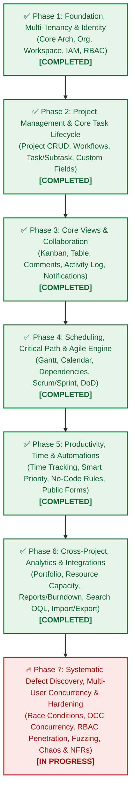

# OmniProject Core — Lộ trình Phát triển theo Giai đoạn (Development Phases Roadmap)

> **Mục tiêu:** Phân rã 24 phân hệ tính năng (107 sub-features) của OmniProject Core thành các Phase phát triển tuần tự từ **Nền tảng (Foundation)** đến **Nâng cao (Advanced)** và **Tấn công Phát hiện Lỗi (Systematic Defect Discovery & Hardening)**, đảm bảo tính phụ thuộc dữ liệu (Data Dependency), khả năng kiểm thử độc lập (Independent Testability) và chất lượng hệ thống đạt chuẩn doanh nghiệp (Enterprise-grade).

---

## 🧭 Ma trận Phụ thuộc & Nguyên tắc Sắp xếp (Architectural Principles)

Để đảm bảo hệ thống mở rộng tốt (Scalability), không bị đập đi làm lại schema (Efficiency), và kiến trúc rõ ràng cho team dev (Maintainability), thứ tự phát triển tuân thủ triệt để đồ thị phụ thuộc (DAG - Directed Acyclic Graph):

```mermaid
flowchart TD
    P1["✅ Phase 1: Foundation, Multi-Tenancy & Identity<br/>(Core Arch, Org, Workspace, IAM, RBAC)<br/><b>[COMPLETED]</b>"] --> P2["✅ Phase 2: Project Management & Core Task Lifecycle<br/>(Project CRUD, Workflows, Task/Subtask, Custom Fields)<br/><b>[COMPLETED]</b>"]
    P2 --> P3["✅ Phase 3: Core Views & Collaboration<br/>(Kanban, Table, Comments, Activity Log, Notifications)<br/><b>[COMPLETED]</b>"]
    P3 --> P4["✅ Phase 4: Scheduling, Critical Path & Agile Engine<br/>(Gantt, Calendar, Dependencies, Scrum/Sprint, DoD)<br/><b>[COMPLETED]</b>"]
    P4 --> P5["✅ Phase 5: Productivity, Time & Automations<br/>(Time Tracking, Smart Priority, No-Code Rules, Public Forms)<br/><b>[COMPLETED]</b>"]
    P5 --> P6["✅ Phase 6: Cross-Project, Analytics & Integrations<br/>(Portfolio, Resource Capacity, Reports/Burndown, Search OQL, Import/Export)<br/><b>[COMPLETED]</b>"]
    P6 --> P7["🔥 Phase 7: Systematic Defect Discovery, Multi-User Concurrency & Hardening<br/>(Race Conditions, OCC Concurrency, RBAC Penetration, Fuzzing, Chaos & NFRs)<br/><b>[IN PROGRESS]</b>"]

    style P1 fill:#e6f4ea,stroke:#137333,stroke-width:2px,color:#0d652d
    style P2 fill:#e6f4ea,stroke:#137333,stroke-width:2px,color:#0d652d
    style P3 fill:#e6f4ea,stroke:#137333,stroke-width:2px,color:#0d652d
    style P4 fill:#e6f4ea,stroke:#137333,stroke-width:2px,color:#0d652d
    style P5 fill:#e6f4ea,stroke:#137333,stroke-width:2px,color:#0d652d
    style P6 fill:#e6f4ea,stroke:#137333,stroke-width:2px,color:#0d652d
    style P7 fill:#fce8e6,stroke:#c5221f,stroke-width:2px,color:#a50e0e
```

---

## 📌 Bảng Tổng hợp Các Giai đoạn (Phases Breakdown)

| Phase | Tên Giai đoạn (Phase Name) | Trạng thái (Status) | Trọng tâm Nghiệp vụ | Phân hệ Tính năng (FR Modules) | Số Sub-features | Điều kiện Tiên quyết (Prerequisites) |
|---|---|---|---|---|---|---|
| **Phase 1** | **Foundation, Multi-Tenancy & IAM** | <mark>**✅ Đã hoàn thành (Completed)**</mark> | Hạ tầng kỹ thuật, Định danh, Tổ chức, Phân quyền RBAC, Multi-tenant isolation | - **FR-PRJ-000**: Core Architecture, NFRs & RBAC - **FR-ORG-001**: Workspace, Org & Billing - **FR-ORG-002**: IAM, Invites & User Groups | 10 sub-features + Core Specs | None (Khởi đầu) |
| **Phase 2** | **Project & Core Task Lifecycle** | <mark>**✅ Đã hoàn thành (Completed)**</mark> | Không gian dự án, Quản lý trạng thái luồng (Workflow), Thực thể Task, Subtask & Trường tùy biến | - **FR-PRJ-018**: Project Lifecycle & Templates - **FR-PRJ-002**: Dynamic Workflow & WIP Limits - **FR-PRJ-006**: Subtask Management - **FR-PRJ-004**: Dynamic Custom Fields (EAV) | 17 sub-features | Phase 1 |
| **Phase 3** | **Execution Views & Collaboration** | <mark>**✅ Đã hoàn thành (Completed)**</mark> | Giao diện làm việc trực quan (Kanban/Table), Tương tác đội ngũ realtime, Thông báo nội bộ & Không gian cá nhân | - **FR-PRJ-001.1, 001.3**: Kanban & Table View - **FR-PRJ-005**: Task Collaboration (Rich-text, Attachments, Comments, Mentions) - **FR-PRJ-015**: Personal Space & My Tasks - **FR-PRJ-013**: In-app Notification Center | 16 sub-features | Phase 2 |
| **Phase 4** | **Scheduling, Timeline & Agile** | <mark>**✅ Đã hoàn thành (Completed 08-11-2026)**</mark> | Kế hoạch hóa dòng thời gian, Đường găng (CPM), Khung làm việc Scrum/Sprint & Chuẩn bàn giao nghiêm ngặt | - **FR-PRJ-001.2, 001.4**: Realtime Sync & Admin Radar - **FR-PRJ-003**: Dependency & Critical Path - **FR-PRJ-016**: Calendar View (Month/Week/Day) - **FR-PRJ-009**: Scrum & Sprint Planning - **FR-PRJ-017**: Recurring Tasks (Cron/RRULE) - **FR-PRJ-008**: Strict DoD & Output Contract | 22 sub-features | Phase 3 |
| **Phase 5** | **Productivity, Time & Automation** | <mark>**✅ Đã hoàn thành (Completed 13-11-2026)**</mark> | Tối ưu hóa năng suất cá nhân, Chấm công / Định lượng thời gian, Luật tự động hóa No-code & Tiếp nhận yêu cầu | - **FR-PRJ-014**: Time Tracking (Timer & Timesheet) - **FR-PRJ-007**: Smart Prioritization (Action Score) - **FR-PRJ-020**: No-Code Automations (Triggers, Conditions, Actions) - **FR-PRJ-021**: Public Forms & Task Intake | 19 sub-features | Phase 4 |
| **Phase 6** | **Portfolio, Analytics & Integrations** | <mark>**✅ Đã hoàn thành (Completed 15-11-2026)**</mark> | Bức tranh tổng thể đa dự án, Cân bằng tải nhân sự, Báo cáo tiến độ chuẩn Agile, Tìm kiếm nâng cao & Chuyển đổi dữ liệu | - **FR-PRJ-010**: Portfolio & Multi-Project Dashboard - **FR-PRJ-011**: Resource & Capacity Management - **FR-PRJ-012**: Reporting & Analytics (Burndown, Velocity) - **FR-PRJ-019**: Global Search (Cmd+K, OQL) - **FR-PRJ-022**: Data Import, Export & Migration | 23 sub-features | Phase 5 |
| **Phase 7** | **Systematic Defect Discovery, Multi-User Concurrency & Hardening** | 🚀 **Đang triển khai (In Progress)** | Tấn công tìm lỗi toàn diện: Đua tranh 2-3 người cùng sửa 1 việc, Xung đột OCC, Leo thang quyền RBAC, Fuzzing OQL, Rung lắc mạng & NFRs | - **ATK-01**: Multi-User Concurrency & Race Conditions - **ATK-02**: RBAC, IDOR & Multi-Tenant Boundary - **ATK-03**: Blackbox, Graybox & Whitebox Attacks - **ATK-04**: Chaos & NFR Resiliency Under Stress | Toàn bộ 24 phân hệ | Phase 1 $\to$ 6 |

---

## 🔍 Chi tiết Từng Giai đoạn Phát triển

### 🧱 Phase 1: Foundation, Multi-Tenancy & IAM (Nền móng & Danh tính) — ✅ ĐÃ HOÀN THÀNH (COMPLETED)
* **Trạng thái:** ✅ **Hoàn thành (Completed)**
* **Ý nghĩa:** Đây là tầng "xương sống". Mọi đối tượng trong hệ thống đều phải trực thuộc một `organization_id` và `workspace_id`, được bảo vệ bởi cơ chế bảo mật và phân quyền 4 cấp.
* **Module chi tiết:**
  1. **FR-PRJ-000**: Core Technical Architecture, NFRs (SLA <100ms, Uptime 99.9%, mã hóa AES-256), Kiến trúc Multi-tenancy, RBAC 4 cấp (`WORKSPACE_ADMIN`, `PROJECT_MANAGER`, `MEMBER`, `VIEWER`), RACI matrix.
  2. **FR-ORG-001**: Workspace & Organization Management (Tạo Org/Workspace, cấu hình chung, chuyển đổi Multi-workspace, Subscription tiering, Audit Log cấp Org).
  3. **FR-ORG-002**: Identity & Access Management (Mời thành viên, User Directory, Nhóm người dùng User Groups, Cấu hình SSO SAML/OIDC, Brute-force protection).
* **Hiện vật nghiệm thu (Completed Deliverables):**
  - [x] **SRS Đặc tả Yêu cầu Phần mềm:** [01_SRS_PHASE1_FOUNDATION.md](./01_SRS_PHASE1_FOUNDATION.md) (Chuẩn IEEE 830, Data Dictionary, API Contracts, Multi-tenancy Isolation, RBAC & SSO).
  - [x] **RTM Ma trận Truy vết Yêu cầu:** [02_RTM_PHASE1_FOUNDATION.csv](./02_RTM_PHASE1_FOUNDATION.csv) (Mapping FR -> User Stories Gherkin -> Test Cases).
  - [x] **Database Schema & NFRs:** Định nghĩa chi tiết schema Users, Organizations, Workspaces, Memberships, Roles, Audit Logs trong [FR-PRJ-000](./FR-PRJ-000_core_technical_architecture.md).

---

### 📂 Phase 2: Project & Core Task Lifecycle (Quản trị Dự án & Thực thể Task) — ✅ ĐÃ HOÀN THÀNH (COMPLETED)
* **Trạng thái:** ✅ **Hoàn thành (Completed 30-09-2026)**
* **Ý nghĩa:** Định nghĩa không gian làm việc (Project) và đơn vị công việc cốt lõi (Task/Subtask). Đặt ra các quy tắc về luồng trạng thái (Workflow) và khả năng mở rộng dữ liệu động (Custom Fields).
* **Module chi tiết:**
  1. **FR-PRJ-018**: Project Lifecycle & Templates (Khởi tạo dự án, áp dụng/lưu Project Templates, Archive/Unarchive dự án).
  2. **FR-PRJ-002**: Dynamic Workflow & WIP Limits (Tùy biến cột trạng thái Statuses, Handoff rules, Cảnh báo và override giới hạn WIP).
  3. **FR-PRJ-006**: Subtask Management (Cấu trúc Task cha - con, cập nhật trạng thái độc lập, tính toán tiến độ cộng dồn Progress Roll-up).
  4. **FR-PRJ-004**: Dynamic Custom Fields (Mô hình EAV: Text, Number, Currency, Date, Dropdown, Checkbox; Validation rules, Filter & Sort).
* **Hiện vật nghiệm thu (Completed Deliverables):**
  - [x] **SRS & RTM Phase 2:** [`02_SRS_PHASE2_OMNIPROJECT_CORE.md`](./phase_2/02_SRS_PHASE2_OMNIPROJECT_CORE.md) & [`03_RTM_PHASE2_OMNIPROJECT_CORE.csv`](./phase_2/03_RTM_PHASE2_OMNIPROJECT_CORE.csv).
  - [x] **Kế hoạch & Nhật ký kỹ thuật Phase 2:** [`02_project_core_changelog.md`](file:///Users/macbookair/Downloads/source/omnimer_team/backend_otm/project_core/docs/change_log/02_project_core_changelog.md) (Hoàn thành 9/9 bước kỹ thuật).
  - [x] **Tài liệu Feature Design (Giai đoạn 1 Triad):** `04_project_lifecycle_templates.md`, `05_dynamic_workflows_wip.md`, `06_dynamic_custom_fields_eav.md`, `07_subtask_progress_rollup.md`.
  - [x] **Đặc tả API Handoff Frontend (Giai đoạn 3 Triad):** `07_project_lifecycle_templates_api.md`, `08_dynamic_workflows_wip_api.md`, `09_dynamic_custom_fields_api.md`, `10_subtask_management_api.md`.
  - [x] **Mã nguồn Backend & Repositories:** Strict Repositories, Strategy Validators, Services, Controllers, Routes, Zod DTOs, Realtime WebSockets & Audit Trail.
  - [x] **Kiểm thử Tự động & NFR QA/QC:** 20 Test Suites, 167 Tests (100% Pass), QA Scorecard Grade A (98.5/100), Kiểm thử thực nghiệm API 55/55 endpoints PASS (03-10-2026).

---

### 📋 Phase 3: Execution Views & Collaboration (Giao diện Thực thi & Phối hợp) — ✅ ĐÃ HOÀN THÀNH (COMPLETED)
* **Trạng thái:** ✅ **Hoàn thành (Completed 07-11-2026)**
* **Ý nghĩa:** Cung cấp trải nghiệm người dùng thực tế hàng ngày cho Dev và Member: kéo thả thẻ trên Kanban, quản lý dạng Bảng (Table), trao đổi bình luận, nhận thông báo và quản lý không gian việc cá nhân.
* **Module chi tiết:**
  1. **FR-PRJ-001 (Part 1 - Kanban & Table)**: Chuyển đổi View Switcher, Kanban Board kéo thả mượt mà, Table View dạng bảng tính, bảo lưu bộ lọc & sắp xếp (View State).
  2. **FR-PRJ-005**: Task Collaboration (Mô tả Rich Text/Markdown, Upload File Attachments, Comment & @mention realtime, Activity Log lịch sử thay đổi).
  3. **FR-PRJ-015**: Personal Space & My Tasks (Tự động tạo "My Space", Dashboard "My Tasks" gom việc từ mọi dự án, Quick-add Task `Q`, Private Tasks).
  4. **FR-PRJ-013 (In-app)**: Notification Center (Hộp thư Inbox chuông thông báo, Đánh dấu đọc, Notification Preferences, Do Not Disturb DND).
* **Hiện vật nghiệm thu (Completed Deliverables):**
  - [x] **SRS Đặc tả Yêu cầu Phần mềm:** [`04_SRS_PHASE3_EXECUTION_VIEWS_COLLABORATION.md`](./phase_3/04_SRS_PHASE3_EXECUTION_VIEWS_COLLABORATION.md) (Chuẩn IEEE 830, Data Model ERD, Event Bus v2, Real-time Collaboration & Activity Stream, Detailed API Contracts & Wireframes).
  - [x] **RTM Ma trận Truy vết Yêu cầu:** [`05_RTM_PHASE3_EXECUTION_VIEWS_COLLABORATION.csv`](./phase_3/05_RTM_PHASE3_EXECUTION_VIEWS_COLLABORATION.csv) (Mapping toàn diện 160 test case Gherkin cho 4 phân hệ FR-PRJ-001, 005, 015, 013).
  - [x] **WebSocket/SSE Event bus cho Real-time Collaboration & Activity Stream** (`ws:project`, `ws:task`, `ws:user`).
  - [x] **Giao diện người dùng cốt lõi** (Kanban Board, Virtual Table View, Task Detail Modal/Drawer, My Tasks, In-app Notification Center).
  - [x] **Kiểm thử tự động E2E Playwright và tích hợp Edge Cloudflare Workers** (100% Pass 16/16 Tasks in DONE).

---

### ⏱ Phase 4: Scheduling, Timeline & Agile Engine (Kế hoạch hóa & Khung Agile) — ✅ ĐÃ HOÀN THÀNH (COMPLETED)
* **Trạng thái:** ✅ **Hoàn thành (Completed 08-11-2026)**
* **Ý nghĩa:** Nâng cấp hệ thống từ công cụ ghi nhận công việc thành một **Enterprise PMIS thực thụ**: có khả năng tính toán đường găng, dự báo rủi ro trễ hạn, điều phối Gantt/Calendar và chu trình Sprint của Scrum.
* **Module chi tiết:**
  1. **Phase 4A (Core Agile & Scheduling Engine):**
     - **FR-PRJ-009**: Scrum & Sprint Management (Sprint Planning Workspace, Khóa 1 Active Sprint `BL-PRJ-009.1`, Start/Complete Sprint & Rollover `BL-PRJ-009.4`).
     - **FR-PRJ-016**: Calendar View (Chế độ hiển thị Month/Week/Day, kéo thả đổi Due Date, Quick-add từ ô ngày trống, Unscheduled Tasks).
     - **FR-PRJ-008**: Strict DoD & Output Contract (Ràng buộc đầu ra bắt buộc: File/Figma/PR, Done Blocker `BL-PRJ-008.2`, Ngoại lệ Personal Space `BL-PRJ-008.4`).
  2. **Phase 4B (Timeline, Dependencies & Risk Radar):**
     - **FR-PRJ-001 (Part 2 - Gantt & Radar)**: Gantt Chart thời gian thực, Admin Radar cảnh báo Task khẩn cấp/blocked.
     - **FR-PRJ-003**: Dependency & Critical Path (4 loại liên kết FS/SS/FF/SF, Cycle Detection DAG, Auto-scheduling lan truyền tiến độ, Đường găng CPM).
     - **FR-PRJ-017**: Recurring Tasks (Thiết lập chu kỳ lặp RRULE/Cron, tự sinh Task mới khi Done, quản lý Series).
* **Hiện vật nghiệm thu Phase 4 (Completed Deliverables):**
  - [x] **SRS Đặc tả Yêu cầu Phần mềm Hợp nhất:** [`06_SRS_PHASE4A_CORE_AGILE_SCHEDULING_ENGINE.md`](./phase_4/06_SRS_PHASE4A_CORE_AGILE_SCHEDULING_ENGINE.md).
  - [x] **RTM Ma trận Truy vết:** [`07_RTM_PHASE4A_CORE_AGILE_SCHEDULING_ENGINE.csv`](./phase_4/07_RTM_PHASE4A_CORE_AGILE_SCHEDULING_ENGINE.csv) (Mapping 37 test cases cho cả 5 FRs).
  - [x] **Mã nguồn Backend & Frontend hoàn chỉnh:** 42 Test Suites, 406 Tests PASS 100%, Sprint Planning Workspace, Interactive Calendar View, Strict DoD Done-blocker Modal.

---

### ⚡ Phase 5: Productivity, Time & Automations (Năng suất & Tự động hóa) — ✅ ĐÃ HOÀN THÀNH (COMPLETED)
* **Trạng thái:** ✅ **Hoàn thành (Completed 13-11-2026)**
* **Ý nghĩa:** Tự động hóa quy trình lặp lại, tiết kiệm thời gian cho đội ngũ, chấm công/đo lường nỗ lực thực tế và mở cổng tiếp nhận yêu cầu từ người dùng bên ngoài.
* **Module chi tiết:**
  1. **FR-PRJ-014**: Time Tracking (Timer đếm giờ realtime, Manual Log, so sánh estimated vs actual, Timesheet tuần, Xuất Time Report).
  2. **FR-PRJ-007**: Smart Prioritization (Phân quyền Owner vs Assignee, Thuật toán Action Score tự động tính độ ưu tiên, Smart Sort, Chống gian lận hạn chót Anti-gaming).
  3. **FR-PRJ-020**: No-Code Automations (Bộ luật If-This-Then-That: Triggers, Conditions, Actions; Execution Logs).
  4. **FR-PRJ-021**: Public Forms & Task Intake (Form Builder kéo thả, Sinh Public link/iframe, reCAPTCHA v3 chống spam, tự sinh Task từ Form).
* **Hiện vật nghiệm thu Phase 5 (Completed Deliverables):**
  - [x] **SRS Đặc tả Yêu cầu Phần mềm Hợp nhất:** [`08_SRS_PHASE5_PRODUCTIVITY_TIME_AUTOMATIONS.md`](./phase_5/08_SRS_PHASE5_PRODUCTIVITY_TIME_AUTOMATIONS.md).
  - [x] **RTM Ma trận Truy vết:** [`09_RTM_PHASE5_PRODUCTIVITY_TIME_AUTOMATIONS.csv`](./phase_5/09_RTM_PHASE5_PRODUCTIVITY_TIME_AUTOMATIONS.csv) (48 test cases đầy đủ).
  - [x] **Mã nguồn Backend & Frontend:** Redis ephemeral timer, PostgreSQL time_logs, BullMQ Background Worker cho Event Rule Engine, Floating Realtime Timer Widget, Weekly Timesheet view, Visual No-Code Automation Builder & Public Form Intake Portal. Pass 529/530 backend tests & E2E 100%.

---

### 📊 Phase 6: Cross-Project, Analytics & Integrations (Quản trị Danh mục & Phân tích) — ✅ ĐÃ HOÀN THÀNH (COMPLETED 15-11-2026)
* **Trạng thái:** ✅ **Hoàn thành (Completed 15-11-2026)**
* **Ý nghĩa:** Tầng cao nhất phục vụ Ban Giám Đốc, PMO và Khách hàng: giám sát danh mục nhiều dự án (Portfolio), cân đối tải nguồn lực (Workload), đo lường chỉ số vận hành (Burndown, Velocity, Cycle Time) và di chuyển dữ liệu.
* **Module chi tiết:**
  1. **FR-PRJ-010**: Portfolio & Multi-Project Dashboard (Portfolio Board, Program Gantt liên dự án, Risk Radar tổng hợp, Project Health Score 0-100).
  2. **FR-PRJ-011**: Resource & Capacity Management (Workload View 40h/tuần, Availability Calendar xin nghỉ, Cảnh báo Overload, Gợi ý Re-assign).
  3. **FR-PRJ-012**: Reporting & Analytics (Burndown Chart lý tưởng vs thực tế, Velocity Chart 3 sprint gần nhất, Cycle Time, Xuất báo cáo PDF/CSV).
  4. **FR-PRJ-019**: Global Search & Advanced Filtering (Phím tắt `Cmd+K`, Full-text search trong mô tả/comment, Bộ lọc OQL `assignee:me AND status:!done`, Saved Filters).
  5. **FR-PRJ-022**: Data Import, Export & Migration (Import CSV/Excel mapping, OAuth Importer từ Trello/Jira, Full Project Export ZIP).
* **Hiện vật nghiệm thu Phase 6 (Completed Deliverables):**
  - [x] **SRS Đặc tả Yêu cầu Phần mềm Hợp nhất:** [`10_SRS_PHASE6_PORTFOLIO_ANALYTICS_INTEGRATIONS.md`](./phase_6/10_SRS_PHASE6_PORTFOLIO_ANALYTICS_INTEGRATIONS.md).
  - [x] **RTM Ma trận Truy vết:** [`11_RTM_PHASE6_PORTFOLIO_ANALYTICS_INTEGRATIONS.csv`](./phase_6/11_RTM_PHASE6_PORTFOLIO_ANALYTICS_INTEGRATIONS.csv) (37/37 Test Cases).
  - [x] **Mã nguồn Backend APIs (Docs 25–29):** 37 Endpoints RESTful tuân thủ Zod `.strict()`, BullMQ ETL worker, OQL Compiler (AST/Lexer), HealthScoreEngine, WorkloadCalculator.
  - [x] **Mã nguồn Frontend UI:** Portfolio Dashboard View, Program Gantt, Workload Heatmap, Reporting Analytics (Burndown, Velocity, Flow Metrics, Throughput), Global Search Modal (`Cmd+K`) & OQL Query Bar, Data Migration Importer/Exporter.
  - [x] **OmniMer MCP Server (`@omnimer/mcp-server` v2.0.0):** 67 MCP Tools, 5 Resources, 6 Resource Templates, 4 Prompts, stdio contract test 100% PASS.

---

### 🔥 Phase 7: Systematic Defect Discovery, Multi-User Concurrency & Hardening (Tấn công Tìm kiếm Lỗi Toàn diện) — 🚀 ĐANG TRIỂN KHAI (IN PROGRESS)
* **Trạng thái:** 🚀 **Đang triển khai (In Progress — Tháng 11/2026)**
* **Mục tiêu tối thượng:** Chuyển từ trạng thái "code chạy đúng theo kịch bản lý tưởng (Happy Path)" sang **"chủ động tấn công, rung lắc và phá vỡ hệ thống theo kịch bản cực đoan"** nhằm tìm ra mọi lỗi tiềm ẩn về:
  1. **Đua tranh dữ liệu (Race Conditions) & Xung đột OCC** khi 2–3 người cùng thao tác đồng thời trên một Task/Sprint/Dự án.
  2. **Hở sườn phân quyền (RBAC Penetration, IDOR, Tenant Isolation Leakage)** giữa các Organization, Workspace, Project và vai trò người dùng.
  3. **Bao phủ kĩ thuật 3 hộp (Blackbox, Graybox, Whitebox)**: Kiểm thử biên BVA 3 điểm, phân lớp tương đương EP, phân tích đường dẫn mã nguồn, mutation testing & event loop stalls.
  4. **Khả năng chịu đựng hỗn loạn (Chaos Engineering & NFR Resilience)**: Đứt kết nối WebSocket giữa chừng, mất mạng khi upload R2, lỗi BullMQ queue worker, và dội tải (Spike load).
* **Kế hoạch Tấn công Chi tiết:** Xem tài liệu đặc tả độc lập: [`12_SYSTEMATIC_DEFECT_DISCOVERY_ATTACK_PLAN.md`](./12_SYSTEMATIC_DEFECT_DISCOVERY_ATTACK_PLAN.md).

---

## 🎯 Kế hoạch Bước kế tiếp (Next Steps)

Theo quy trình BDA & Triết lý Phát triển chuẩn chỉ:
1. ~~**Duyệt lộ trình 6 Phase** ở tài liệu này.~~ *(✅ Hoàn thành)*
2. ~~**Triển khai Phase 1: Foundation, Multi-Tenancy & IAM**~~ *(✅ Hoàn thành)*
3. ~~**Triển khai Phase 2: Project Management & Core Task Lifecycle**~~ *(✅ Hoàn thành)*
4. ~~**Triển khai Phase 3: Execution Views & Collaboration**~~ *(✅ Hoàn thành)*
5. ~~**Triển khai Phase 4: Scheduling, Timeline & Agile Engine**~~ *(✅ Hoàn thành)*
6. ~~**Triển khai Phase 5: Productivity, Time & Automations**~~ *(✅ Hoàn thành)*
7. ~~**Triển khai Phase 6: Cross-Project, Analytics & Integrations**~~ *(✅ Hoàn thành)*
8. 🚀 **Kích hoạt Phase 7: Systematic Defect Discovery, Multi-User Concurrency & Hardening Attack Plan**:
   - [x] Lập kế hoạch tấn công toàn diện 4 vector tại [`12_SYSTEMATIC_DEFECT_DISCOVERY_ATTACK_PLAN.md`](./12_SYSTEMATIC_DEFECT_DISCOVERY_ATTACK_PLAN.md).
   - [ ] Triển khai kịch bản Playwright Multi-context mô phỏng 3 User (Alice, Bob, Charlie) cùng kéo thả / sửa 1 Task đồng thời để bẫy lỗi `412 PRECONDITION_FAILED` và đồng bộ Realtime WebSocket.
   - [ ] Thực hiện bộ test IDOR & Privilege Escalation (User role `VIEWER` / `MEMBER` tấn công 37 endpoint Phase 6 và các lệnh Override WIP, Sprint Start/Complete, Project Export).
   - [ ] Chạy Fuzzing AST trên OQL Parser và kiểm thử biên (BVA 3-value) trên các công thức Health Score, Workload, Action Score.
   - [ ] Xuất báo cáo Defect Scorecard & Đề xuất vá lỗi kiến trúc (Fix & Harden Patch).
