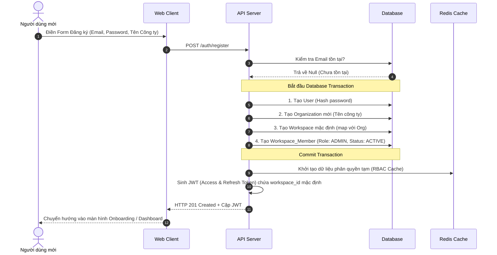
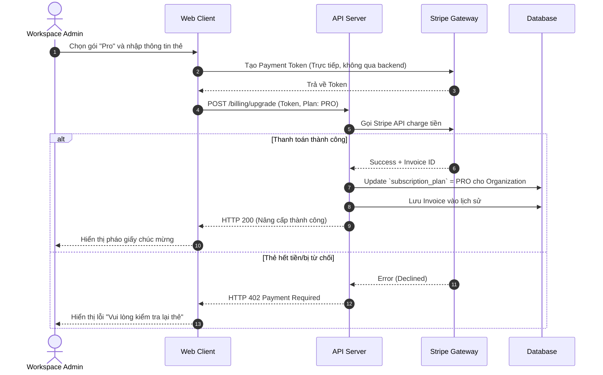

# Feature: Workspace & Organization Management (FR-ORG-001)

**Mô tả:** Phân hệ quản lý cấu trúc cao nhất của hệ thống bao gồm Organization (Đại diện cho 1 doanh nghiệp) và Workspace (Không gian làm việc cho các phòng ban). Quản lý thông tin chung, cài đặt mặc định, và thanh toán (Billing).
**Priority:** P1 (High) - Bắt buộc phải có để SaaS hoạt động.

---

## 1. Functional Requirements List

| FR ID | Requirement Description | Input | Output | Associated Business Rule | Priority |
|---|---|---|---|---|---|
| **FR-ORG-001.1** | **Tạo Organization & Workspace:** Khi user đăng ký mới, hệ thống tự động tạo 1 Organization và 1 Default Workspace. User trở thành Org Owner. | Thông tin công ty, Tên Workspace | Record trong DB | BL-ORG-001.1 | Must-have |
| **FR-ORG-001.2** | **Quản lý Cấu hình Workspace:** Cho phép Workspace Admin chỉnh sửa tên, logo, timezone mặc định, và format ngày/giờ cho toàn bộ Workspace. | Form Settings | Cập nhật cấu hình | None | Must-have |
| **FR-ORG-001.3** | **Subscription & Billing:** Quản lý gói cước (Free, Pro, Enterprise). Hiển thị số lượng seat (tài khoản) đang sử dụng, chu kỳ thanh toán, và xuất hóa đơn VAT. | Nâng cấp gói, Thêm thẻ tín dụng | Gọi API Stripe | BL-ORG-001.2 | Must-have |
| **FR-ORG-001.4** | **Multi-Workspace Switcher:** Cho phép 1 User có thể tham gia nhiều Workspace khác nhau và dễ dàng chuyển đổi qua lại từ Menu góc trái màn hình. | Click chọn Workspace khác | Reload data theo context mới | BL-ORG-001.3 | Must-have |
| **FR-ORG-001.5** | **Audit Log (Cấp độ Org):** Lưu vết toàn bộ các hành động mang tính quản trị (Tạo project mới, xóa project, đổi gói cước, xuất dữ liệu hàng loạt). | Trigger từ backend | Danh sách log immutable | BL-ORG-001.4 | Should-have |

---

## 2. Business Logic & Rules

* **BL-ORG-001.1 (Org-Workspace 1-N):** 1 Organization có thể chứa nhiều Workspace. Tuy nhiên, ở Phase 1 (MVP), để đơn giản hóa UX, hệ thống sẽ tự động map 1 Organization = 1 Workspace (Mô hình Flat).
* **BL-ORG-001.2 (Billing & Capacity Lock):**
  * Gói Free: Giới hạn tối đa 5 members, 3 Projects.
  * Khi Workspace đạt giới hạn gói cước, nút "Mời thành viên" hoặc "Tạo Project mới" sẽ bị disable và hiển thị popup yêu cầu nâng cấp gói.
  * Nếu thẻ tín dụng thanh toán thất bại, Workspace có 14 ngày "Grace Period". Sau 14 ngày, chuyển toàn bộ Workspace sang chế độ "Read-only" (Không ai tạo/sửa được Task).
* **BL-ORG-001.3 (Data Isolation):** Dữ liệu (Tasks, Projects, Users) được phân tách hoàn toàn giữa các Workspace (Multi-tenant). API bắt buộc phải validate `workspace_id` trong mọi request. User không thể search task của Workspace A khi đang đứng ở Workspace B.
* **BL-ORG-001.4 (Audit Retention):** Audit Log cấp quản trị được lưu trữ 90 ngày (với gói Pro) và Vĩnh viễn (với gói Enterprise) để phục vụ thanh tra.

---

## 3. Data Structure

### Entity: Organization
| Field | Data Type | Required | Constraints |
|---|---|---|---|
| `org_id` | UUID | Yes | Primary Key |
| `name` | String | Yes | VD: "Công ty Cổ phần VNG" |
| `billing_email` | String | Yes | |
| `subscription_plan` | Enum | Yes | `FREE`, `PRO`, `ENTERPRISE` |
| `stripe_customer_id`| String | No | ID khách hàng bên Stripe |

### Entity: Workspace
| Field | Data Type | Required | Constraints |
|---|---|---|---|
| `workspace_id` | UUID | Yes | Primary Key |
| `org_id` | UUID | Yes | Foreign Key |
| `name` | String | Yes | VD: "Zalo Team", "Game Studio" |
| `timezone` | String | Yes | VD: `Asia/Ho_Chi_Minh` |
| `is_active` | Boolean | Yes | |

---

## 4. Sequence Diagrams

### 4.1. Khởi tạo Tenant (Tạo Organization & Workspace)


### 4.2. Nâng cấp gói cước (Upgrade Subscription)



---

## 5. Tiêu chí Chấp nhận (Acceptance Criteria)

**Là** Chủ doanh nghiệp,
**Tôi muốn** xem chi tiết giới hạn tài nguyên của gói cước hiện tại và dễ dàng nâng cấp bằng thẻ tín dụng,
**Để** công ty tôi không bị gián đoạn công việc khi số lượng nhân sự tăng lên.

**Acceptance Criteria (Gherkin):**
```gherkin
Given Workspace của tôi đang dùng gói Free (giới hạn 5 users)
When tôi cố gắng mời người thứ 6 vào Workspace
Then hệ thống chặn lại và hiện popup "Bạn đã đạt giới hạn gói Free. Vui lòng nâng cấp gói Pro"

Given tôi đang ở màn hình Billing
When tôi nhập thẻ tín dụng và chọn thanh toán cho gói Pro (10 users)
Then hệ thống charge tiền thành công và lập tức mở khóa quyền hạn cho phép tôi mời thêm người
And một hóa đơn (Invoice) được tạo tự động để tôi có thể tải về PDF
```
