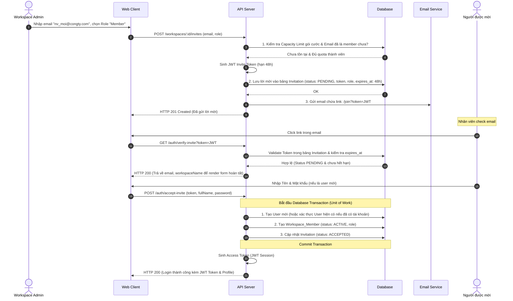
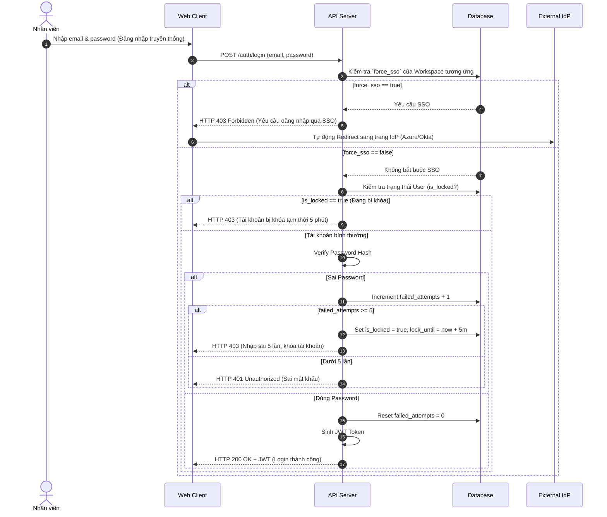

# Feature: Identity & Access Management - IAM (FR-ORG-002)

**Mô tả:** Phân hệ quản lý danh tính và quyền truy cập cấp Workspace. Bao gồm việc quản lý vòng đời người dùng (Mời, Vô hiệu hóa, Xóa), gán vai trò tổng (Workspace Roles) và cấu hình Single Sign-On (SSO) để tích hợp với hệ thống doanh nghiệp.
**Priority:** P1 (High)

---

## 1. Functional Requirements List

| FR ID | Requirement Description | Input | Output | Associated Business Rule | Priority |
|---|---|---|---|---|---|
| **FR-ORG-002.1** | **Mời thành viên (Invite Members):** Cho phép Workspace Admin gửi email mời người dùng mới vào Workspace. Có thể chọn trước Role cấp Workspace. | Email list, Role | Gửi Email chứa link Join | BL-ORG-002.1 | Must-have |
| **FR-ORG-002.2** | **Quản lý Directory (Member List):** Màn hình hiển thị toàn bộ thành viên trong Workspace. Cho phép Admin tìm kiếm, lọc, thay đổi Role, hoặc vô hiệu hóa (Deactivate) tài khoản. | Keyword, Thao tác chỉnh sửa | Cập nhật DB | BL-ORG-002.2 | Must-have |
| **FR-ORG-002.3** | **Quản lý Nhóm (User Groups):** Cho phép tạo các Nhóm người dùng (Ví dụ: "Backend Team", "Designers"). Nhóm này có thể được dùng để `assignee` hoặc `@mention` hàng loạt. | Tên nhóm, Danh sách thành viên | Group được tạo | None | Should-have |
| **FR-ORG-002.4** | **Cấu hình SSO (SAML/OIDC):** Màn hình cho phép Admin điền các thông tin IdP (Identity Provider) như ACS URL, Entity ID, x509 Certificate để bật SSO cho Workspace. | Thông tin IdP | Kích hoạt luồng đăng nhập SSO | BL-ORG-002.3 | Should-have |
| **FR-ORG-002.5** | **Khóa tài khoản tự động (Auto-Lock):** Tự động khóa tài khoản hoặc buộc đổi mật khẩu nếu phát hiện đăng nhập sai quá 5 lần (Brute-force protection). | Hành động login sai | Khóa user 5 phút | BL-ORG-002.4 | Must-have |

---

## 2. Business Logic & Rules

* **BL-ORG-002.1 (Invite Token & Expiration):** Link mời (Invite link) được sinh ra có chứa mã JWT hợp lệ trong 48 giờ. Nếu hết hạn, Admin phải gửi lại thư mời.
* **BL-ORG-002.2 (Deactivation vs Deletion):** 
  * Khi nhân viên nghỉ việc, Admin sử dụng chức năng **Deactivate (Vô hiệu hóa)** thay vì Delete.
  * *Lý do:* Giữ lại toàn bộ lịch sử công việc (Audit Log, Time Log) của nhân viên đó. User bị Deactivate không thể đăng nhập và không bị tính phí (không tính vào số lượng seat của gói cước).
* **BL-ORG-002.3 (SSO Enforcement):** Nếu Workspace bật tính năng "Force SSO", mọi user có email domain của công ty đó (VD: `@vng.com.vn`) bắt buộc phải đăng nhập qua nút SSO. Đăng nhập bằng Password truyền thống sẽ bị chặn.
* **BL-ORG-002.4 (Security Lock):** Nếu tài khoản chưa cấu hình SSO mà sử dụng password, sau 5 lần nhập sai liên tiếp, hệ thống khóa IP và Account trong 5 phút. Có gửi email cảnh báo "Phát hiện đăng nhập bất thường" cho user.

---

## 3. Data Structure

### Entity: User
| Field | Data Type | Required | Constraints |
|---|---|---|---|
| `user_id` | UUID | Yes | Primary Key |
| `email` | String | Yes | Unique |
| `password_hash`| String | No | Null nếu đăng nhập qua SSO |
| `full_name` | String | Yes | |
| `avatar_url` | String | No | |

### Entity: Workspace_Member
| Field | Data Type | Required | Constraints |
|---|---|---|---|
| `id` | UUID | Yes | Primary Key |
| `workspace_id` | UUID | Yes | Foreign Key |
| `user_id` | UUID | Yes | Foreign Key |
| `role` | Enum | Yes | `ADMIN`, `PM`, `MEMBER`, `GUEST` (Cấp Workspace) |
| `status` | Enum | Yes | `INVITED`, `ACTIVE`, `DEACTIVATED` |

### Entity: Invitation
| Field | Data Type | Required | Constraints |
|---|---|---|---|
| `id` | UUID | Yes | Primary Key |
| `workspace_id` | UUID | Yes | Foreign Key |
| `email` | String | Yes | Email người được mời |
| `role` | Enum | Yes | `ADMIN`, `PM`, `MEMBER`, `GUEST` |
| `token` | String | Yes | JWT Invite Token (Unique) |
| `status` | Enum | Yes | `PENDING`, `ACCEPTED`, `EXPIRED`, `REVOKED` |
| `invited_by_user_id` | UUID | Yes | Foreign Key |
| `expires_at` | DateTime | Yes | NOW() + 48 hours |

### Entity: Workspace_SSO_Config
| Field | Data Type | Required | Constraints |
|---|---|---|---|
| `workspace_id` | UUID | Yes | Primary Key |
| `sso_type` | Enum | Yes | `SAML`, `OIDC` |
| `idp_entity_id`| String | Yes | |
| `idp_acs_url` | String | Yes | |
| `x509_cert` | Text | Yes | Chứng chỉ công khai từ IdP |
| `force_sso` | Boolean | Yes | Ép buộc đăng nhập qua SSO (Backend alias: `is_enforced`) |

---

## 4. Sequence Diagrams

### 4.1. Luồng mời thành viên (Invite Flow)


### 4.2. Luồng Cưỡng chế SSO (Force SSO) & Khóa tự động (Auto-Lock)


---

## 5. Tiêu chí Chấp nhận (Acceptance Criteria)

**Là** IT Admin của công ty,
**Tôi muốn** vô hiệu hóa tài khoản của nhân viên đã nghỉ việc chỉ bằng 1 nút bấm,
**Để** họ lập tức mất quyền truy cập vào dữ liệu công ty nhưng hệ thống vẫn giữ nguyên các task họ đã làm trước đây.

**Acceptance Criteria (Gherkin):**
```gherkin
Given Nhân viên A đang có trạng thái ACTIVE trong Workspace
When tôi bấm nút "Deactivate" (Vô hiệu hóa) tài khoản của A
Then phiên đăng nhập (Session) hiện tại của A lập tức bị hủy, đẩy A ra khỏi ứng dụng
And A không thể đăng nhập lại vào hệ thống
And trên các bảng Kanban, các Task cũ của A vẫn hiển thị avatar và tên của A bình thường

Given Workspace đã cấu hình thành công SAML SSO với Azure AD và bật "Force SSO"
When nhân viên nhập email công ty vào trang Login thông thường và bấm "Tiếp tục"
Then hệ thống tự động redirect nhân viên đó sang trang đăng nhập của Microsoft Azure thay vì hỏi mật khẩu
```
