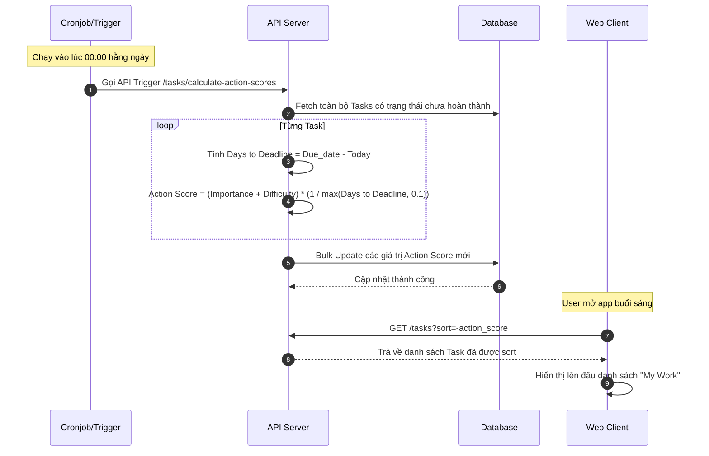

# Feature: Smart Prioritization & Delegation Chain (FR-PRJ-007)

**Mô tả:** Hệ thống hỗ trợ giao việc phân cấp nhiều tầng (Delegation Chain) và tự động tính toán điểm ưu tiên (Action Score) dựa trên thuật toán lấy cảm hứng từ ma trận Eisenhower thay vì nhãn thủ công (Low/Medium/High).
**Priority:** P1 (High)

## 1. Functional Requirements List

| FR ID | Requirement Description | Input | Output | Associated Business Rule | Priority |
|---|---|---|---|---|---|
| **FR-PRJ-007.1** | **Giao việc phân quyền (Delegation):** Hỗ trợ mô hình 2 vai trò trên một Task: `Owner` (Người chịu trách nhiệm cuối cùng) và `Assignee` (Người trực tiếp thực thi). | Chọn Owner và Assignee | Lưu 2 ID này vào DB | BL-PRJ-007.1 | Must-have |
| **FR-PRJ-007.2** | **Tính toán Action Score:** Hệ thống tự động tính toán điểm ưu tiên của mỗi Task dựa trên độ quan trọng, độ khó và thời gian còn lại (Deadline). | Importance, Difficulty & Due Date | Action Score (Float) | BL-PRJ-007.2 | Must-have |
| **FR-PRJ-007.3** | **Tự động sắp xếp (Smart Sort):** Màn hình "My Work" / Kanban cột To-Do tự động sắp xếp danh sách Task từ trên xuống dưới theo Action Score giảm dần. | Action Score | List UI được sắp xếp | BL-PRJ-007.2 | Must-have |
| **FR-PRJ-007.4** | **Bảo vệ Deadline (Anti-Gaming):** Khóa quyền thay đổi Due Date của `Assignee` để tránh tình trạng cố tình lùi Deadline làm giảm Action Score. | Assignee sửa Due Date | Khóa UI / API báo lỗi HTTP 403 | BL-PRJ-007.3 | Must-have |

## 2. Business Logic & Rules

* **BL-PRJ-007.1 (Delegation Accountability):** `owner_id` (VD: Team Lead) giao việc cho `assignee_id` (VD: Staff). Nếu Task trễ hạn, hệ thống tính lỗi (KPI Penalty) cho cả hai, nhưng `owner_id` chịu trách nhiệm báo cáo giải trình.
* **BL-PRJ-007.2 (Smart Action Score):** Điểm ưu tiên được hệ thống tính toán (Cronjob recalculate mỗi nửa đêm hoặc khi có Update) bằng công thức: 
  $$\text{Action Score} = (\text{Importance} + \text{Difficulty}) \times \left( \frac{1}{\max(\text{Days to Deadline}, 0.1)} \right)$$
  (Nếu quá hạn, điểm tự động đẩy lên mức rất cao).
  Task có Action Score càng cao thì càng nằm trên cùng của danh sách.
* **BL-PRJ-007.3 (Deadline Lock Anti-Gaming):** Chỉ người tạo Task (`reporter_id`), `owner_id` hoặc Project Manager mới được phép chỉnh sửa `due_date`. 

## 3. Data Structure

### Entity: Task (Bổ sung Delegation & Priority)
| Field | Data Type | Required | Constraints |
|---|---|---|---|
| `task_id` | UUID | Yes | Primary Key |
| `owner_id` | UUID | Yes | Người chịu trách nhiệm (VD: PM, Lead) |
| `assignee_id` | UUID | No | Người trực tiếp làm (VD: Dev, QA) |
| `importance` | Integer | Yes | Trọng số quan trọng (Từ 1 đến 10), mặc định là 5 |
| `difficulty` | Integer | Yes | Độ khó của công việc (Từ 1 đến 10), mặc định là 3 |
| `due_date` | Timestamp | No | Ngày hết hạn |
| `action_score`| Float | No | Điểm ưu tiên (Tự động tính/Cache) |

## 4. Sequence Diagram: Calculate Action Score



## 5. Tiêu chí Chấp nhận (Acceptance Criteria)

**Là** Nhân viên (Staff),
**Tôi muốn** hệ thống tự động sắp xếp danh sách công việc mỗi sáng dựa trên độ gấp, độ khó và độ quan trọng,
**Để** tôi biết chính xác việc gì cần làm trước mà không phải băn khoăn chọn lựa.

**Acceptance Criteria (Gherkin):**
```gherkin
Given tôi có 2 task: Task A (Quan trọng: 8, Độ khó: 5, Deadline: 5 ngày nữa) và Task B (Quan trọng: 5, Độ khó: 3, Deadline: 1 ngày nữa)
When tôi mở màn hình "My Work" vào buổi sáng
Then hệ thống tự động tính Action Score của Task B cao hơn Task A
And hiển thị Task B ở vị trí ưu tiên số 1

Given tôi là Assignee (người thực thi) của một Task nhưng không phải Owner
When tôi cố gắng đổi ngày "Due Date" sang tuần sau
Then hệ thống chặn lại và hiển thị thông báo "Chỉ Owner hoặc Project Manager mới có quyền thay đổi Deadline"
```
