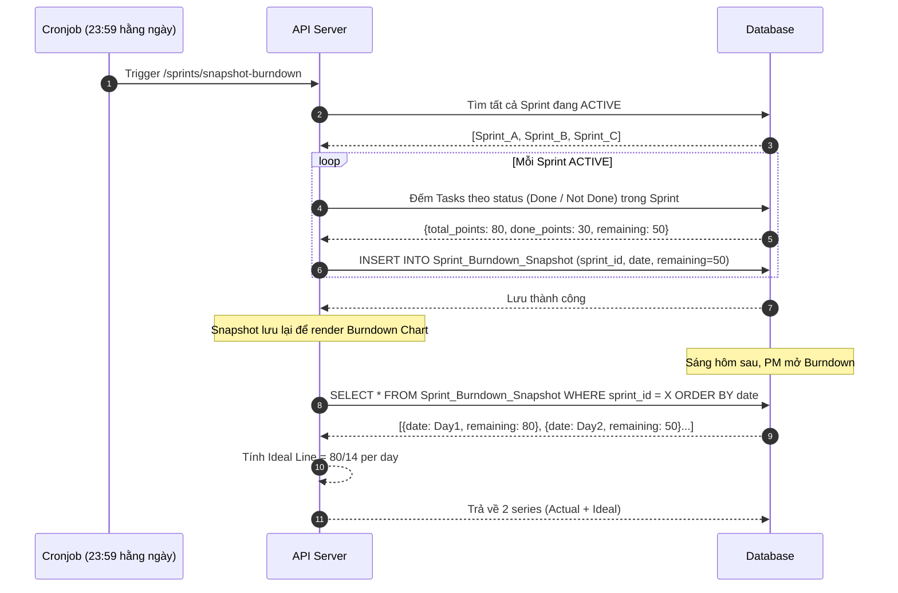

# Feature: Reporting & Analytics (FR-PRJ-012)

**Mô tả:** Cung cấp bộ báo cáo và biểu đồ phân tích hiệu suất dự án theo thời gian thực và lịch sử, giúp PM và Scrum Master đưa ra quyết định dựa trên dữ liệu. Bao gồm Burndown Chart, Velocity Chart, Cycle Time phân phối, và Throughput.
**Priority:** P1 (High)

---

## 1. Functional Requirements List

| FR ID | Requirement Description | Input | Output | Associated Business Rule | Priority |
|---|---|---|---|---|---|
| **FR-PRJ-012.1** | **Burndown Chart:** Hiển thị đồ thị số lượng Story Points (hoặc số Task) còn lại theo ngày trong Sprint. So sánh đường thực tế (Actual) với đường lý tưởng (Ideal). | Sprint đang ACTIVE | Biểu đồ đường 2 series | BL-PRJ-012.1 | Must-have |
| **FR-PRJ-012.2** | **Velocity Chart:** Biểu đồ cột hiển thị tổng Story Points hoàn thành (Done) qua mỗi Sprint. Tính Velocity trung bình trong 3 Sprint gần nhất (rolling average). | Danh sách Sprint CLOSED | Bar chart + Rolling Average line | BL-PRJ-012.2 | Must-have |
| **FR-PRJ-012.3** | **Lead & Cycle Time Distribution:** Biểu đồ phân phối (histogram hoặc scatter) thời gian của 3 chỉ số quản trị tinh gọn (Lean Management): System Lead Time, Delivery Lead Time, và Cycle Time. | Task logs trong khoảng thời gian | Histogram + Percentile (p50, p75, p95) | BL-PRJ-012.3 | Should-have |
| **FR-PRJ-012.4** | **Throughput Chart:** Biểu đồ số lượng Task hoàn thành mỗi ngày/tuần trong một khoảng thời gian. | Khoảng thời gian chọn | Bar/Line chart | None | Should-have |
| **FR-PRJ-012.5** | **Export Báo cáo:** Xuất dữ liệu báo cáo (bảng Task, log thời gian, burndown data) sang định dạng CSV hoặc PDF. | Chọn loại báo cáo + khoảng thời gian | File download | BL-PRJ-012.4 | Should-have |

---

## 2. Business Logic & Rules

* **BL-PRJ-012.1 (Burndown Data Points):** Mỗi ngày trong Sprint, hệ thống ghi lại (snapshot) tổng số Story Points chưa Done tại thời điểm cuối ngày (23:59). Đường Ideal = tổng điểm ban đầu / số ngày Sprint, giảm đều mỗi ngày.

* **BL-PRJ-012.2 (Velocity Calculation):**
  ```
  Sprint_Velocity = Tổng Story_Points của Tasks ở trạng thái DONE khi Sprint kết thúc
  Rolling_Average_Velocity = Average(Sprint[n-2], Sprint[n-1], Sprint[n])
  ```
  Chỉ tính Tasks thuộc Sprint tại thời điểm Sprint kết thúc (không tính Tasks được chuyển vào sau khi đóng).

* **BL-PRJ-012.3 (Lead & Cycle Time Calculation):**
  ```
  System_Lead_Time = Timestamp(Task.status → DONE) - Timestamp(Task.created_at)
  Delivery_Lead_Time = Timestamp(Task.status → DONE) - Timestamp(Task.status → TODO) [Điểm cam kết]
  Cycle_Time = Timestamp(Task.status → DONE) - Timestamp(Task.status → IN_PROGRESS)
  ```
  Tính bằng giờ làm việc (business hours), không tính cuối tuần và ngày nghỉ lễ.

* **BL-PRJ-012.4 (Export Retention):** File export được tạo async (Background Job), lưu trên Cloud Storage 24h rồi tự xóa. API trả về signed download URL.

---

## 3. Data Structure

### Entity: Sprint_Burndown_Snapshot (Append-only)
| Field | Data Type | Required | Constraints |
|---|---|---|---|
| `snapshot_id` | UUID | Yes | Primary Key |
| `sprint_id` | UUID | Yes | Foreign Key |
| `snapshot_date` | Date | Yes | Ngày ghi snapshot |
| `remaining_points` | Integer | Yes | Tổng SP chưa Done |
| `completed_points` | Integer | Yes | Tổng SP đã Done trong ngày |

### Entity: Task (Bổ sung cho Analytics)
| Field | Data Type | Required | Constraints |
|---|---|---|---|
| `story_points` | Integer | No | Ước tính effort theo Fibonacci (1,2,3,5,8,13) |
| `created_at` | Timestamp | Yes | Lúc sinh ra Task ở trạng thái OPEN (Backlog) |
| `committed_at` | Timestamp | No | Lúc Task chuyển sang TODO (Điểm cam kết) |
| `started_at` | Timestamp | No | Lúc Task chuyển sang IN_PROGRESS lần đầu |
| `completed_at` | Timestamp | No | Lúc Task chuyển sang DONE |

---

## 4. Sequence Diagram: Generate Burndown Snapshot (Daily Cronjob)



---

## 5. Tiêu chí Chấp nhận (Acceptance Criteria)

**Là** Scrum Master,
**Tôi muốn** xem Burndown Chart và Velocity Chart sau mỗi Sprint,
**Để** đánh giá khả năng dự báo (predictability) của team và cải thiện quá trình Planning.

**Acceptance Criteria (Gherkin):**
```gherkin
Given Sprint "Sprint 3" đang ACTIVE, tổng 80 Story Points
When tôi mở tab "Reports" → "Burndown Chart"
Then hệ thống hiển thị 2 đường: đường Ideal (giảm đều) và đường Actual (dựa trên dữ liệu thực tế mỗi ngày)

Given Team đã hoàn thành Sprint 1 (40 SP), Sprint 2 (50 SP), Sprint 3 (45 SP)
When tôi xem Velocity Chart
Then hệ thống hiển thị 3 cột bar và đường Velocity trung bình = 45 SP/Sprint

Given tôi muốn xuất báo cáo Task log của tháng 9/2026
When tôi chọn "Export CSV" với khoảng thời gian tương ứng
Then hệ thống tạo file CSV và gửi link download (valid trong 24h)
```
