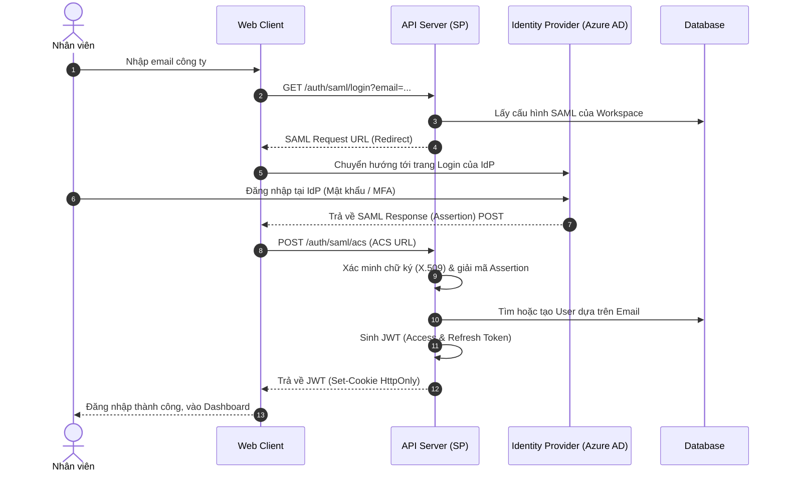
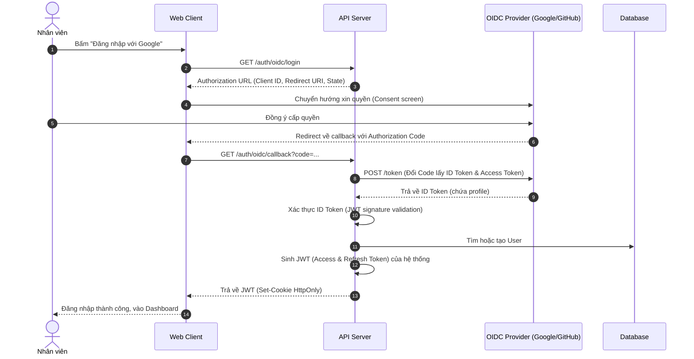
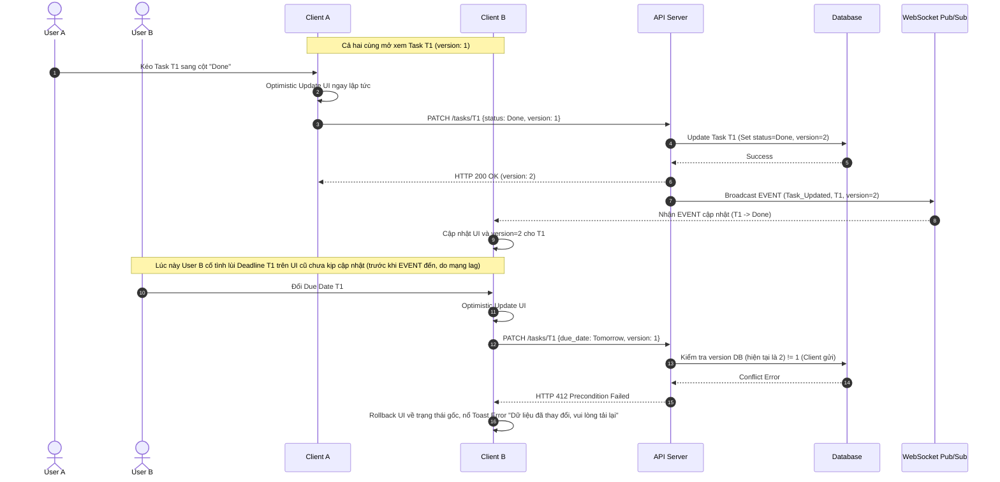

# Core Technical Architecture & Governance (FR-PRJ-000)

**Mô tả:** Tài liệu này quy định các tiêu chuẩn kiến trúc kỹ thuật chung, giao thức mạng, và cơ chế xử lý trạng thái cho toàn bộ các tính năng thuộc `omniproject_core`. Mọi Feature File khác trong thư mục này đều phải kế thừa các tiêu chuẩn tại đây.

---

## 1. Phân quyền và Phạm vi Truy cập (Access Control & Permissions)

Hệ thống sử dụng mô hình **RBAC (Role-Based Access Control)** áp dụng chặt chẽ ở cả Frontend (UI Block) và Backend (API Validation).

### 1.1 Ma trận Phân quyền (RBAC Matrix)

Quy định quyền hạn cụ thể của từng Role trên hệ thống đối với các thao tác cốt lõi:

| Hành động (Action) | Admin | Project Manager (PM) | Team Member | Guest (Client) |
| :--- | :---: | :---: | :---: | :---: |
| **Góc nhìn & Hiển thị** | | | | |
| Đổi View (Kanban, Gantt, Table, Calendar...) | ✅ | ✅ | ✅ | ✅ |
| Xem Private Tasks của người khác | ✅ | ❌ | ❌ | ❌ |
| Xem Portfolio / Cross-project | ✅ | ✅ | ❌ (Chỉ xem task mình) | ❌ |
| **Quản lý Task (Task Management)** | | | | |
| Tạo mới Task / Subtask | ✅ | ✅ | ✅ | ❌ |
| Kéo thả Task (Đổi Status) | ✅ | ✅ | ✅ | ❌ |
| Chỉnh sửa ngày tháng trên Gantt/Calendar | ✅ | ✅ | ❌ (Chỉ xem) | ❌ |
| Lùi Deadline (Due Date) | ✅ | ✅ (Task trong project) | ❌ | ❌ |
| Cập nhật giờ làm (Time Tracking) | ✅ | ✅ | ✅ (Chỉ task của mình) | ❌ |
| Bỏ qua giới hạn WIP (WIP Override) | ✅ | ✅ | ❌ | ❌ |
| Xóa Task | ✅ | ✅ | ❌ | ❌ |
| **Quản lý Project & Quy trình** | | | | |
| Tạo / Cập nhật Custom Workflow | ✅ | ✅ | ❌ | ❌ |
| Thêm Custom Fields | ✅ | ✅ | ❌ | ❌ |
| Thiết lập Sprint (Start/Complete) | ✅ | ✅ | ❌ | ❌ |
| Phê duyệt ngày nghỉ (Leave Approval) | ✅ | ✅ | ❌ | ❌ |
| Mời thành viên vào Project | ✅ | ✅ | ❌ | ❌ |
| Nhận cảnh báo (Real-time Radar / Overload) | ✅ | ✅ | ❌ | ❌ |

### 1.2 Ma trận RACI (Responsibility Assignment)

Mô hình RACI định hình cách phối hợp giữa các vai trò trong suốt vòng đời của một công việc (Task):
* **R (Responsible):** Người trực tiếp nhúng tay vào thực hiện công việc (Ví dụ: `assignee_id`).
* **A (Accountable):** Người duyệt, chịu trách nhiệm cuối cùng nếu công việc hỏng/trễ (Ví dụ: `owner_id`, PM). Chỉ có 1 chữ A duy nhất cho mỗi việc.
* **C (Consulted):** Người đóng góp ý kiến, cung cấp chuyên môn trước/trong khi làm (Ví dụ: Tech Lead, QA, gán qua `@mention`).
* **I (Informed):** Người chỉ cần biết kết quả, không tham gia làm (Ví dụ: Client nhận thông báo tiến độ).

| Giai đoạn / Tác vụ | Admin | PM / Owner | Assignee (Member) | Guest / Client |
| :--- | :---: | :---: | :---: | :---: |
| Khởi tạo Task, định nghĩa DoD | **I** | **A / R** | **C** | **C** (Cung cấp YC) |
| Lên lịch, gán người làm (Assign) | **I** | **A / R** | **I** | **I** |
| Thực thi công việc (In Progress) | **I** | **A** | **R** | **I** |
| Báo cáo rủi ro (Đánh dấu Blocked) | **I** | **A** | **R** | **I** |
| Chuyển giao quy trình (Handoff) | **I** | **A** | **R** | **I** |
| Lùi/Thay đổi Deadline giữa chừng | **I** | **A / R** | **I** | **C** |
| Nghiệm thu (Đánh giá DoD) & Đóng Task | **I** | **A / R** | **C** | **I** |
| Cấu hình Project (Workflow, Sprints) | **A / R** | **A / R** | **I** | **I** |

### 1.2 Trải nghiệm Read-only trên Giao diện
* **Gantt & Kanban:** Đối với Guest hoặc Member không có quyền sửa ngày, thư viện UI (ví dụ `dhtmlxGantt` hoặc `react-beautiful-dnd`) phải kích hoạt cờ `readonly: true`. 
* **Fallback UI:** Các handle kéo thả (drag handles) bị ẩn. Nếu User cố tình dùng devtools để vượt qua frontend, API sẽ bắt chặn lỗi `HTTP 403 Forbidden`.

### 1.3 Xác thực & Đăng nhập (Authentication)

Hệ thống hỗ trợ hai luồng xác thực để đáp ứng cả người dùng cá nhân và enterprise:

| Phương thức | Áp dụng cho | Mô tả |
| :--- | :--- | :--- |
| **Email / Password (JWT)** | Tất cả người dùng | Đăng nhập thông thường, access token (15 phút) + refresh token (30 ngày) lưu ở HttpOnly Cookie. |
| **SSO — SAML 2.0** | Enterprise (trả phí) | Tích hợp với Identity Provider (IdP) doanh nghiệp: Azure AD, Okta, Google Workspace. Người dùng đăng nhập 1 lần (Single Sign-On), không cần tài khoản riêng. |
| **SSO — OIDC (OAuth 2.0)** | Enterprise + Cá nhân | Đăng nhập qua Google, GitHub, Microsoft. Hỗ trợ Authorization Code Flow với PKCE. |

**Luồng SSO SAML 2.0 (tóm tắt):**
1. Admin Workspace cấu hình IdP (nhập Entity ID, ACS URL, Certificate).
2. Nhân viên truy cập OmniProject → Redirect đến IdP doanh nghiệp để xác thực.
3. IdP trả về SAML Assertion → Backend xác minh chữ ký, lấy `email` → Tạo hoặc cập nhật User trong DB → Phát JWT Session.

**Business Rules:**
* **BR-PRJ-000-SSO.1:** Nếu Workspace đã bật "SSO Enforced", đăng nhập bằng email/password bị vô hiệu hóa cho tất cả thành viên (trừ Workspace Admin dùng để quản lý khẩn cấp).
* **BR-PRJ-000-SSO.2:** User đăng nhập SSO lần đầu tự động được gán Role `Team Member`. Admin phải nâng cấp role thủ công hoặc cấu hình role mapping từ IdP group.

#### Sequence Diagram: Luồng Xác thực SAML 2.0


#### Sequence Diagram: Luồng Xác thực OIDC (OAuth 2.0)


---

## 2. Đặc tả API & WebSocket Protocol

### 2.1 REST API Specification
* **Pagination (Phân trang):** 
  * `Table View / Kanban View` sử dụng **Cursor-based Pagination** (nhanh và ổn định hơn khi có thêm/bớt data liên tục). Payload: `?cursor=last_uuid&limit=50`.
  * `Gantt View` sử dụng **Time-window Pagination**. Payload: `?start_date=2026-01-01&end_date=2026-12-31`. Hệ thống chỉ trả về các task có giao với khoảng thời gian này.

### 2.2 WebSocket Protocol
Đóng vai trò cực kỳ quan trọng trong Real-time Radar và View Sync.
* **Connection Strategy:** 
  * Giao thức: `Socket.io` hoặc `SignalR` (hỗ trợ Auto-reconnect và Fallback).
  * Khung tin nhắn chuẩn (Message Frame):
    ```json
    {
      "event_type": "TASK_UPDATED",
      "room_id": "project_uuid",
      "actor_id": "user_uuid_who_did_this",
      "payload": {
        "task_id": "uuid",
        "changed_fields": {"status_id": "new_uuid"}
      },
      "timestamp": "ISO8601",
      "sequence_id": 1042
    }
    ```
* **Heartbeat & Reconnection:** Client ping server mỗi 25s. Nếu rớt mạng, client tự động thử kết nối lại (Exponential Backoff). Nếu WebSocket thất bại hoàn toàn, hạ cấp (fallback) xuống HTTPS Long-Polling.

---

## 3. Client State Management & Đồng bộ Dữ liệu

### 3.1 Optimistic UI Updates
Để mang lại trải nghiệm mượt mà không độ trễ, UI áp dụng **Optimistic Updates**:
1. User kéo thả Task $\rightarrow$ UI thay đổi ngay lập tức (không chờ Server).
2. Gọi API ngầm dưới Background.
3. Nếu API lỗi (VD: `403 Forbidden` do WIP Limits), UI tự động rollback (giật ngược Task về vị trí cũ) và nổ Toast Error.

### 3.2 Quản lý Xung đột Ghi đồng thời (Concurrent Editing)
Hệ thống sử dụng cơ chế **Optimistic Concurrency Control (OCC) thông qua Versioning / ETag** để xử lý xung đột (First-write-wins).
* **Luật:** Mỗi Task trong DB có một trường `version` (int). 
* Khi Client tải Task, lấy được `version = 1`. 
* User A và User B cùng lúc sửa Task. 
* User A gửi API PATCH `{ status: Done, version: 1 }`. Thành công. DB update `version = 2`.
* User B gửi API PATCH `{ status: Blocked, version: 1 }`. 
* Server kiểm tra `version` DB hiện tại là 2 $\neq$ 1 (version B gửi). Server từ chối và trả về `HTTP 412 Precondition Failed`.
* Client B hiển thị Popup: *"Dữ liệu đã bị thay đổi bởi người khác. Vui lòng tải lại!"*. (Loại bỏ cơ chế Lock rườm rà).

### 3.3 Out-of-order Events (Gói tin đến sai thứ tự)
Nếu Client nhận được sự kiện WebSocket có `sequence_id` nhỏ hơn `sequence_id` của bản record đang lưu tại Client, Client phải tự động bỏ qua gói tin đó (Discard) để tránh UI nhảy loạn xạ do mạng giật lag.

#### Sequence Diagram: Optimistic Concurrency Control (OCC) & WebSocket Sync


---

## 4. Yêu cầu Phi chức năng (Non-Functional Requirements - NFRs)

* **Performance (Hiệu năng):** 
  * Thời gian Render lần đầu (First Contentful Paint - FCP) khi chuyển đổi giữa Kanban và Gantt phải $\le 1.0s$ cho dự án chứa $<1,000$ tasks.
  * Độ trễ WebSocket (End-to-end Latency) đảm bảo $< 200ms$ trong điều kiện mạng 4G tiêu chuẩn.
* **Browser & Device Compatibility:** Hỗ trợ chuẩn HTML5 Drag & Drop API trên Desktop và tương thích Touch Events (Long Press to Drag) trên Mobile/Tablet. Dữ liệu View phải đồng bộ xuyên suốt.
* **Security (Bảo mật):**
  * **Rate Limiting:** API endpoints phải áp dụng Rate Limiting. Giới hạn mặc định: `100 requests/phút/user` cho các endpoints thông thường; `10 requests/phút/IP` cho các endpoints xác thực (Login, Forgot Password) để ngăn Brute Force.
  * **OWASP Top 10 Compliance:** Toàn bộ API phải được kiểm thử và đảm bảo không có lỗ hổng theo danh sách OWASP Top 10 (tối thiểu: Injection, XSS, IDOR, Broken Authentication, SSRF).
  * **Input Sanitization:** Mọi input từ user phải được sanitize trước khi lưu DB. Nội dung Markdown được render ở client phải qua thư viện DOMPurify để ngăn XSS.
  * **Secrets Management:** Tuyệt đối không hardcode API key, database credential, hay secret trong source code. Sử dụng Environment Variables và/hoặc Secret Manager (AWS Secrets Manager, HashiCorp Vault).
* **Availability (Tính sẵn sàng):**
  * SLA mục tiêu: **99.5% uptime** (tương đương tối đa ~3.65 giờ downtime/tháng).
  * Triển khai với chiến lược **Zero-downtime deployment** (Rolling update hoặc Blue-Green).

