# Software Requirements Specification (SRS) - OmniProject Core Phase 2
> **Reference Standard:** IEEE Std 830-1998  
> **Project:** OmniProject Core  
> **Phase:** Phase 2 (Dynamic Workflows, Custom Fields, Subtasks, Lifecycle & Templates)

---

## 1. Introduction

### 1.1 Purpose
Tài liệu SRS này đặc tả toàn bộ các yêu cầu phần mềm, yêu cầu phi chức năng (NFR), cấu trúc dữ liệu và các luồng logic chi tiết (Sequence Diagrams) cho Phase 2 của hệ thống OmniProject Core. Tài liệu này đóng vai trò là "Design Contract" chuẩn mực kỹ thuật giữa Đội ngũ Phân tích Nghiệp vụ (BA), Kỹ sư Phát triển (Backend & Frontend), và Đội ngũ Kiểm thử Chất lượng (QA/QC).

### 1.2 Product Scope
Phạm vi Phase 2 tập trung cung cấp năng lực quản trị linh hoạt và tự động hóa cho Project Manager (PM) và các thành viên trong dự án:
- **FR-PRJ-002 (Dynamic Workflows & WIP Limits):** Cấu hình luồng trạng thái tùy chỉnh đa dạng cho từng dự án, cơ chế Meta-Status phục vụ báo cáo liên phòng ban, kiểm soát tắc nghẽn bằng giới hạn WIP (Work In Progress), quy trình bàn giao (Handoff), và quản lý điểm nghẽn qua cờ Blocked.
- **FR-PRJ-004 (Dynamic Custom Fields):** Mở rộng thuộc tính dữ liệu nghiệp vụ của Task tùy biến theo dự án mà không cần thay đổi source code, hỗ trợ ép kiểu an toàn (Type Safety), kiểm tra dữ liệu động và bộ lọc (Filter/Sort).
- **FR-PRJ-006 (Subtask Management):** Phân rã khối lượng công việc thành các đầu mục con (Subtasks) với cơ chế bảo vệ tối đa 1 cấp độ, phân quyền người phụ trách độc lập và tự động cộng dồn tiến độ (Progress Roll-up).
- **FR-PRJ-018 (Project Lifecycle & Templates):** Quản lý vòng đời dự án (Active, Paused, Archived), nhân bản nhanh quy trình chuẩn thông qua Templates, và đóng băng dữ liệu dự án cũ (Archived Immutability).

### 1.3 Definitions & Abbreviations
- **WIP (Work In Progress):** Số lượng công việc tối đa được phép xử lý đồng thời trong một trạng thái/cột nhằm tránh quá tải.
- **Meta-Status:** Danh mục trạng thái trừu tượng cố định của hệ thống (`OPEN`, `TODO`, `IN_PROGRESS`, `IN_REVIEW`, `DONE`, `CANCELED`) để chuẩn hóa báo cáo tổng thể.
- **EAV (Entity-Attribute-Value):** Mô hình lưu trữ cơ sở dữ liệu cho các trường dữ liệu động.
- **Progress Roll-up:** Cơ chế tính toán tự động tỷ lệ % hoàn thành của Task cha dựa trên tỷ lệ Subtask hoàn thành.
- **DoD (Definition of Done):** Tiêu chuẩn hoàn thành của một công việc.
- **RBAC (Role-Based Access Control):** Kiểm soát truy cập dựa trên vai trò người dùng.

### 1.4 References
- [FR-PRJ-002: Dynamic Workflows & WIP Limits](./FR-PRJ-002_dynamic_workflows_wip.md)
- [FR-PRJ-004: Dynamic Custom Fields](./FR-PRJ-004_dynamic_custom_fields.md)
- [FR-PRJ-006: Subtask Management](./FR-PRJ-006_subtask_management.md)
- [FR-PRJ-018: Project Lifecycle Templates](./FR-PRJ-018_project_lifecycle_templates.md)
- [01_SRS_PHASE1_FOUNDATION.md](../phase_1/01_SRS_PHASE1_FOUNDATION.md)
- [03_RTM_PHASE2_OMNIPROJECT_CORE.csv](./03_RTM_PHASE2_OMNIPROJECT_CORE.csv)

---

## 2. Overall Description

### 2.1 Product Perspective
OmniProject Phase 2 vận hành trên hạ tầng Multi-tenant đã được thiết lập ở Phase 1. Hệ thống cung cấp REST API và WebSocket Event Bus kết nối cơ sở dữ liệu PostgreSQL (kết hợp JSONB Indexing và quan hệ chặt chẽ). Dữ liệu được cô lập tuyệt đối theo `workspace_id` và `project_id`.

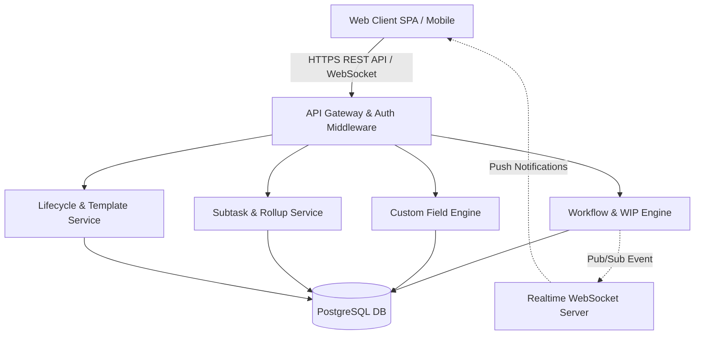

### 2.2 Product Functions
1. **Quy trình luồng linh hoạt (Dynamic Workflows):**
   - Tạo, sửa, xóa, sắp xếp cột trạng thái (Custom Status).
   - Bắt buộc ánh xạ vào 1 trong 6 Meta-Status cốt lõi.
   - Thiết lập và cưỡng chế kiểm tra WIP Limit khi kéo thả Task.
   - Cho phép PM vượt rào WIP (WIP Override).
   - Tự động gợi ý chuyển giao người phụ trách (Handoff Assignee) và bắn thông báo.
   - Gán cờ cảnh báo kẹt công việc (Blocked Flag) kèm lý do.
2. **Trường dữ liệu tùy chỉnh (Dynamic Custom Fields):**
   - Định nghĩa trường mới với các kiểu: `TEXT`, `NUMBER`, `CURRENCY`, `DATE`, `DROPDOWN`, `CHECKBOX`.
   - Cấu hình validation: `is_required`, giá trị min/max, danh sách lựa chọn Dropdown.
   - Lưu trữ, kiểm tra định dạng dữ liệu phía server (Server-side Type Enforcement).
   - Tìm kiếm, lọc (Filter) và sắp xếp (Sort) Task dựa trên Custom Field.
   - Xóa mềm (Soft Delete) Custom Field để bảo toàn lịch sử dữ liệu.
3. **Quản lý công việc con (Subtasks):**
   - Tạo, chỉnh sửa, xóa Subtasks bên trong Task gốc.
   - Gán người phụ trách (Assignee) và Deadline độc lập với Task cha.
   - Tự động cộng dồn tiến độ % của Task cha (Progress Roll-up).
   - Hỗ trợ hiển thị mở rộng cây công việc (Tree-view) trên bảng danh sách.
4. **Vòng đời dự án & Template chuẩn hóa (Project Lifecycle & Templates):**
   - Khởi tạo dự án mới độc lập hoặc sao chép nguyên mẫu từ Template (System Template & Workspace Template).
   - Lưu trữ một dự án đang vận hành thành Template tái sử dụng.
   - Đóng/Lưu trữ (Archive) dự án: đưa về trạng thái đóng băng chỉ đọc (Read-only) và ẩn khỏi giao diện vận hành hằng ngày.
   - Khôi phục (Unarchive) dự án về trạng thái hoạt động (Active).

### 2.3 User Classes & Characteristics
| User Class | Mô tả đặc điểm | Quyền hạn trong Phase 2 |
|---|---|---|
| **Workspace Admin** | Chủ sở hữu hoặc Quản trị viên Workspace | Quản lý toàn bộ Projects, quản lý System/Workspace Templates, can thiệp cấu hình hệ thống, kiểm soát hạn mức lưu trữ/dự án của gói dịch vụ. |
| **Project Manager (PM)** | Người điều phối dự án cụ thể | Tạo và cấu hình Workflows, quy định WIP Limits, Override WIP, tạo Custom Fields, lưu dự án thành Template, Archive/Unarchive dự án, phân bổ thành viên. |
| **Team Member** | Thành viên thực thi trực tiếp các đầu việc | Kéo thả chuyển trạng thái Task (trong giới hạn WIP), cập nhật giá trị Custom Fields, đánh dấu cờ Blocked, tạo/hoàn thành Subtasks. Không có quyền sửa cấu hình Workflow/Custom Field. |
| **Observer / Guest** | Khách hàng hoặc đối tác giám sát tiến độ | Quyền chỉ đọc (Read-only): Xem bảng Kanban, xem tiến độ Task/Subtask, xem các trường Custom Fields. Không được phép chỉnh sửa. |

### 2.4 General Constraints & Business Rules
1. **Hierarchy Depth Constraint (BL-PRJ-006.2):** Cấu trúc phân cấp Task chỉ hỗ trợ tối đa **1 cấp độ con** (`Parent Task` -> `Child Subtask`). Hệ thống nghiêm cấm tạo Subtask bên trong một Subtask (No Grandchildren).
2. **Parent-Child Completion Constraint (BL-PRJ-006.3):** Không thể chuyển Task cha sang trạng thái hoàn thành (`DONE`) nếu vẫn còn ít nhất 1 Subtask chưa hoàn thành (`Incomplete`). Hệ thống ném lỗi HTTP 400 Bad Request.
3. **Workflow Integrity Constraint (BL-PRJ-002.3):** Không được phép xóa một cột trạng thái nếu bên trong cột đó vẫn còn tồn tại Task. Bắt buộc phải di chuyển toàn bộ Task sang cột khác trước khi thực hiện xóa.
4. **WIP Enforcement & Privilege Constraint (BL-PRJ-002.1 & BL-PRJ-002.2):** Khi cột đạt ngưỡng WIP, thao tác kéo thả của Member bị từ chối và đẩy thẻ về vị trí cũ. Chỉ PM hoặc Admin mới có quyền xác nhận "WIP Override".
5. **Task Blocked Constraint (BL-PRJ-002.5):** Khi Task bị gán cờ `is_blocked = true`, Task bị khóa tại cột hiện tại. Thành viên bắt buộc phải giải tỏa cờ ("Resolve Block") trước khi có thể kéo Task sang cột khác.
6. **Workspace Quota Constraint (BL-PRJ-018.1):** Kiểm tra giới hạn số lượng dự án theo gói cước (Gói Free tối đa 3 dự án Active). Nếu vượt quá, chặn tạo mới và yêu cầu nâng cấp gói cước.
7. **Archived Immutability Constraint (BL-PRJ-018.3):** Dự án ở trạng thái `ARCHIVED` bị đóng băng hoàn toàn. Mọi hành vi sửa đổi Task, Comment, Subtask, Custom Field đều bị từ chối (HTTP 403 / Read-only). Đồng thời các Task này bị loại trừ khỏi các màn hình "My Tasks", "Portfolio Dashboard" và "Workload View".

### 2.5 Lean Metrics Calculation (Quản trị tinh gọn)
Hệ thống tính toán tự động 4 chỉ số hiệu suất căn cứ trên thời điểm chuyển đổi Meta-Status:
- **Điểm cam kết (Commitment Point):** Thời điểm Task được di chuyển từ Meta-Status `OPEN` (Backlog) sang `TODO` (Kanban Board cam kết).
- **System Lead Time:** $T_{\text{DONE}} - T_{\text{CREATED}}$ (Tổng thời gian từ lúc tạo thẻ tại Backlog đến khi hoàn thành).
- **Delivery Lead Time:** $T_{\text{DONE}} - T_{\text{TODO}}$ (Tốc độ giao hàng thực tế của đội ngũ tính từ điểm cam kết).
- **Cycle Time:** $T_{\text{DONE}} - T_{\text{IN\_PROGRESS}}$ (Thời gian thao tác kỹ thuật thực tế để giải quyết Task).

---

## 3. Specific Non-Functional Requirements (NFRs)
> Toàn bộ NFR được định lượng bằng chỉ số đo lường cụ thể (Measurable Thresholds) theo chuẩn IEEE 830-1998.

### 3.1 Performance Requirements (Hiệu năng)
| ID | Requirement Description | Measurable Threshold |
|---|---|---|
| **NFR-PRF-001** | Thời gian phản hồi API CRUD thông thường | 95% số lượng request (P95) $\le 200\text{ms}$; 99% request (P99) $\le 400\text{ms}$ dưới tải 500 req/sec. |
| **NFR-PRF-002** | Thời gian nhân bản Dự án từ Template | Quá trình Clone Template chứa $\le 200$ Task mẫu, Workflow và Custom Fields hoàn tất trong thời gian $\le 1.8\text{s}$. |
| **NFR-PRF-003** | Độ trễ kích hoạt Progress Roll-up | Thời gian từ lúc Subtask chuyển trạng thái đến khi Task cha tính toán lại `% progress` và ghi DB $\le 45\text{ms}$. |
| **NFR-PRF-004** | Hiệu năng Tìm kiếm & Lọc (Filter/Sort) theo Custom Field | Thời gian truy vấn lọc dữ liệu phức tạp $\le 350\text{ms}$ trên tập dữ liệu $50,000$ Tasks nhờ PostgreSQL GIN Indexing. |
| **NFR-PRF-005** | Độ trễ thông báo thời gian thực (WebSocket Latency) | Sự kiện Handoff Assignee hoặc Cập nhật Kanban được phát tới Client trong thời gian $\le 80\text{ms}$. |

### 3.2 Security & Data Protection (Bảo mật)
| ID | Requirement Description | Measurable Threshold & Reference Standard |
|---|---|---|
| **NFR-SEC-001** | Kiểm soát phân quyền đa tầng (RBAC Enforcement) | 100% API cấu hình (Workflow, Custom Field, WIP Override, Archive) chặn đứng truy cập trái phép với mã phản hồi `HTTP 403 Forbidden` trong thời gian $\le 15\text{ms}$. (OWASP Broken Object Level Authorization) |
| **NFR-SEC-002** | Kiểm duyệt dữ liệu đầu vào (Input Sanitization & Type Safety) | Kiểm tra dữ liệu Custom Field phía Server. Lọc mã độc XSS (DOMPurify/Sanitizer). Từ chối payload sai kiểu với mã `HTTP 422 Unprocessable Entity`. (OWASP A03: Injection) |
| **NFR-SEC-003** | Bảo vệ dữ liệu Đa khách thuê (Multi-tenant Isolation) | Mọi câu truy vấn Database bắt buộc phải kèm cặp điều kiện khóa ngoại `workspace_id = context.current_workspace` và `project_id = context.current_project`. |
| **NFR-SEC-004** | Nhật ký kiểm toán hành vi trọng yếu (Audit Logging) | 100% hành vi Override WIP, Thay đổi quyền Task, Xóa Custom Field, và Archive Project phải được lưu trữ vào bảng `Audit_Log` (User ID, IP, Timestamp, Old Value, New Value) với thời gian lưu trữ tối thiểu 365 ngày. |

### 3.3 Reliability & Availability (Độ tin cậy & Sẵn sàng)
| ID | Requirement Description | Measurable Threshold |
|---|---|---|
| **NFR-AVL-001** | Tính khả dụng của Hệ thống (Uptime) | Đạt tối thiểu $99.9\%$ Uptime hằng tháng (tổng thời gian gián đoạn ngoài kế hoạch $\le 43.8$ phút/tháng). |
| **NFR-AVL-002** | Tính toàn vẹn giao dịch (ACID Transaction Integrity) | Quá trình Clone Template và Cập nhật Roll-up phải thực thi trong Database Transaction. Nếu có bất kỳ lỗi nào xảy ra, 100% trạng thái phải được Rollback nguyên vẹn, không để sót dữ liệu rác (Orphan Records). |
| **NFR-AVL-003** | Khả năng tự phục hồi kết nối Real-time | Khi WebSocket bị ngắt kết nối đột ngột, Client tự động kết nối lại theo thuật toán Exponential Backoff ($1\text{s}, 2\text{s}, 4\text{s}, 8\text{s}... \max 30\text{s}$) và gọi API đồng bộ bù sai lệch trạng thái. |

### 3.4 Scalability (Khả năng mở rộng)
| ID | Requirement Description | Measurable Threshold |
|---|---|---|
| **NFR-SCA-001** | Khả năng mở rộng dung lượng Task & Fields | Kiến trúc cơ sở dữ liệu hỗ trợ tối thiểu $2,000,000$ bản ghi Task Custom Values và $500,000$ Tasks trên mỗi Workspace mà không làm suy giảm tốc độ query quá $15\%$. |
| **NFR-SCA-002** | Khả năng mở rộng không trạng thái (Stateless Scaling) | Backend API Server hoàn toàn Stateless, cho phép Horizontal Pod Autoscaling (HPA) từ 2 lên 20 pods khi mức chiếm dụng CPU vượt ngưỡng $70\%$. |

### 3.5 Maintainability & Extensibility (Khả năng bảo trì)
| ID | Requirement Description | Measurable Threshold |
|---|---|---|
| **NFR-MNT-001** | Thiết kế mở rộng kiểu Custom Field | Áp dụng Strategy Pattern cho Dynamic Validator; thời gian bổ sung một kiểu dữ liệu mới (ví dụ: `FORMULA`, `GEO_LOCATION`) chỉ cần thêm 1 Validator Class độc lập mà không phải sửa logic controller hiện có. |
| **NFR-MNT-002** | Độ bao phủ kiểm thử tự động (Test Coverage) | Mã nguồn các module cốt lõi (Workflow, WIP, Roll-up, Template) phải đạt độ bao phủ Unit & Integration Test tối thiểu $\ge 85\%$. |

### 3.6 Usability (Trải nghiệm người dùng)
| ID | Requirement Description | Measurable Threshold |
|---|---|---|
| **NFR-USB-001** | Phản hồi giao diện kéo thả (Drag-and-Drop Responsiveness) | Thao tác kéo thả Task trên Kanban hiển thị Optimistic UI ngay lập tức trong vòng $\le 16\text{ms}$ (tương đương chuẩn 60fps). Nếu Server trả về lỗi WIP, thẻ tự động trượt mượt mà (smooth transition) về vị trí cũ kèm Toast thông báo trong $\le 200\text{ms}$. |
| **NFR-USB-002** | Độ rõ ràng của thông báo lỗi (Error Clarity) | 100% thông báo lỗi nghiệp vụ hiển thị bằng tiếng Việt rõ nghĩa, chỉ đích danh nguyên nhân (ví dụ: "Cột Đang làm đã đạt giới hạn tối đa 3 công việc. Chỉ Quản lý dự án mới có quyền đưa thêm"). |

### 3.7 Compatibility (Tương thích môi trường)
| ID | Requirement Description | Measurable Threshold |
|---|---|---|
| **NFR-CMP-001** | Hỗ trợ trình duyệt Web | Tương thích và hoạt động ổn định không lỗi hiển thị trên: Chrome $\ge 90$, Microsoft Edge $\ge 90$, Mozilla Firefox $\ge 88$, Safari $\ge 14$. |
| **NFR-CMP-002** | Đáp ứng màn hình (Responsive Display) | Giao diện tối ưu hoàn toàn cho độ phân giải màn hình từ Desktop tiêu chuẩn ($1920\times1080$, $1440\times900$, $1366\times768$) đến Laptop và Tablet ($1024\times768$). |

---

## 4. Data Models & Schema Design

### 4.1 Entity Relationship Diagram (Phase 2 Entities)

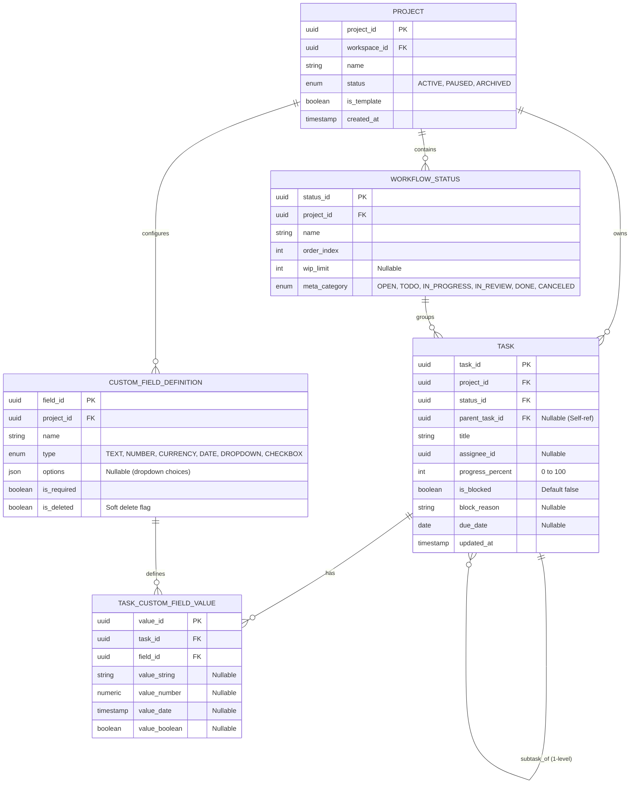

---

## 5. Detailed Sequence Diagrams (CRUD & Operational Flows)

### 5.1 Dynamic Workflows & WIP Management (FR-PRJ-002)

#### 5.1.1 Create Workflow Status (Tạo cột quy trình)
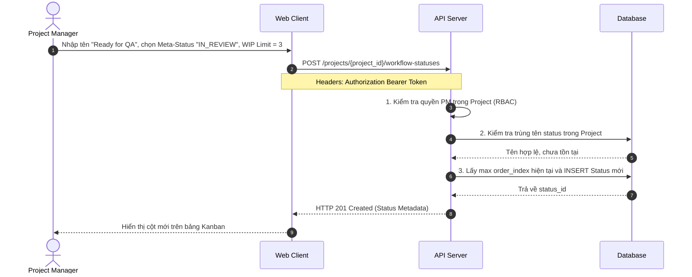

#### 5.1.2 Read / Get Workflow Statuses
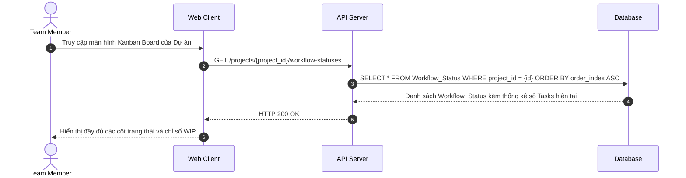

#### 5.1.3 Update Workflow Status (Đổi tên, Thứ tự, WIP Limit)
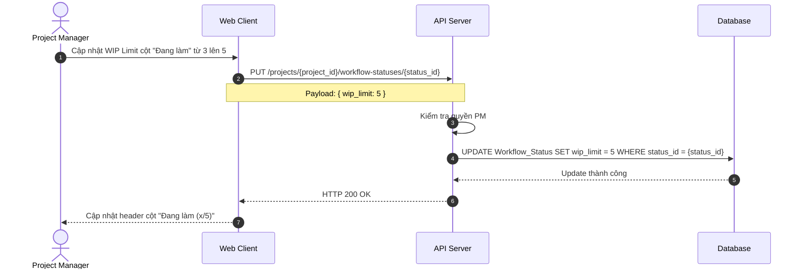

#### 5.1.4 Delete Workflow Status (Ràng buộc toàn vẹn BL-PRJ-002.3)
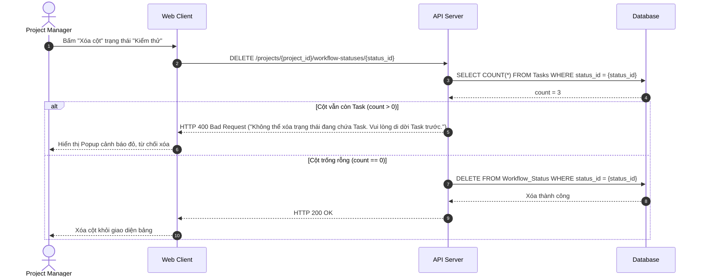

#### 5.1.5 Move Task with WIP Check, PM Override & Handoff (FR-PRJ-002.2 -> 002.4)
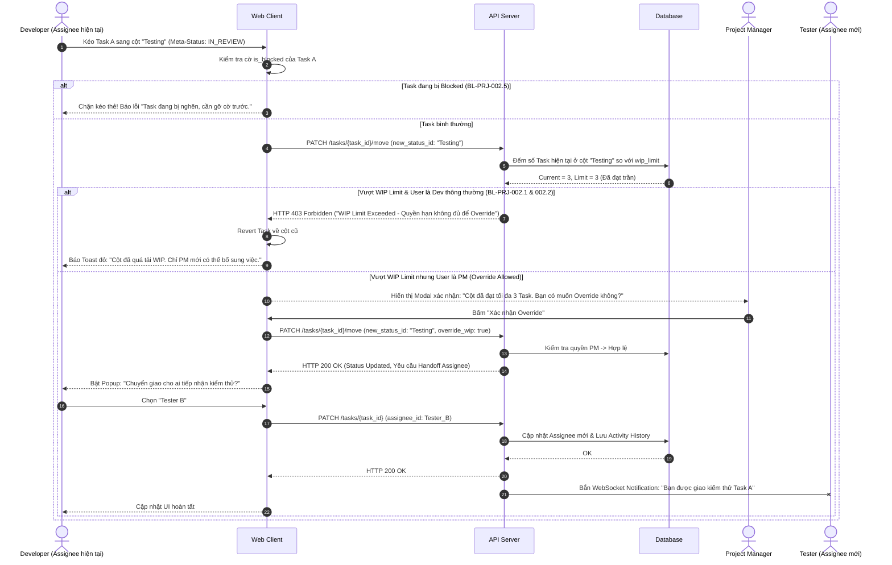

#### 5.1.6 Toggle Task Blocked State (FR-PRJ-002.5)
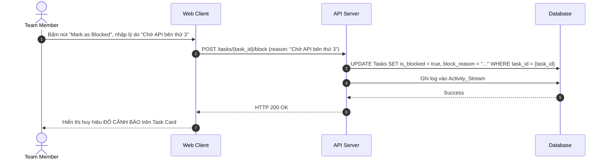

---

### 5.2 Dynamic Custom Fields (FR-PRJ-004)

#### 5.2.1 Create Custom Field Definition
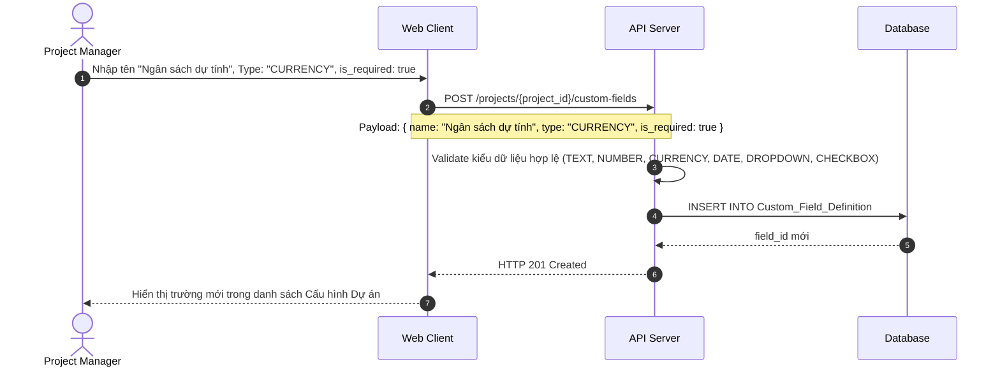

#### 5.2.2 Read Custom Fields & Task Values
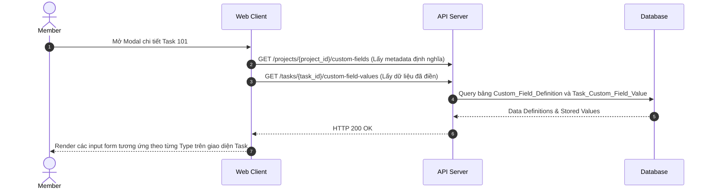

#### 5.2.3 Update / Set Custom Field Value with Type Safety (BL-PRJ-004.1)
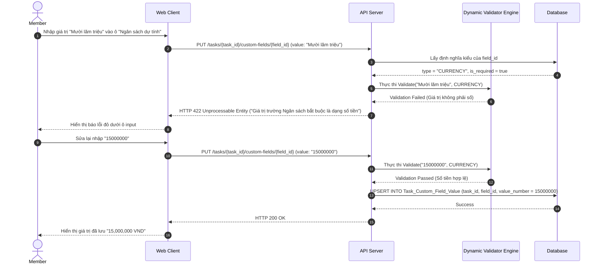

#### 5.2.4 Filter and Sort Tasks by Custom Field (FR-PRJ-004.4 & BL-PRJ-004.3)
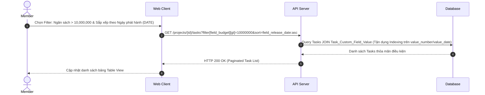

#### 5.2.5 Delete Custom Field (Soft Delete BL-PRJ-004.2)
```mermaid
sequenceDiagram
    autonumber
    actor PM as Project Manager
    participant Client as Web Client
    participant API as API Server
    participant DB as Database

    PM->>Client: Nhấn xóa trường "Ngân sách dự tính"
    Client->>API: DELETE /projects/{project_id}/custom-fields/{field_id}
    API->>API: Kiểm tra quyền PM
    API->>DB: UPDATE Custom_Field_Definition SET is_deleted = true WHERE field_id = {field_id}
    DB-->>API: Update thành công
    API-->>Client: HTTP 200 OK ("Đã ẩn trường tùy chỉnh thành công")
    Client-->>PM: Ẩn trường khỏi cấu hình; dữ liệu cũ trên Task vẫn được bảo toàn
```

---

### 5.3 Subtask Management (FR-PRJ-006)

#### 5.3.1 Create Subtask (Kiểm soát 1 cấp độ BL-PRJ-006.2)
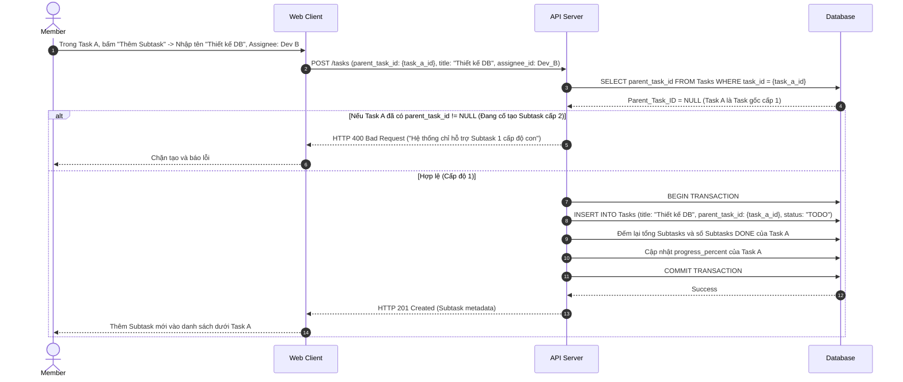

#### 5.3.2 Read Subtasks (Tree-view Expansion FR-PRJ-006.4)
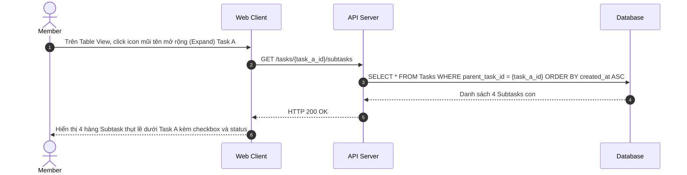

#### 5.3.3 Update Subtask & Auto Progress Roll-up (FR-PRJ-006.3 & BL-PRJ-006.1)
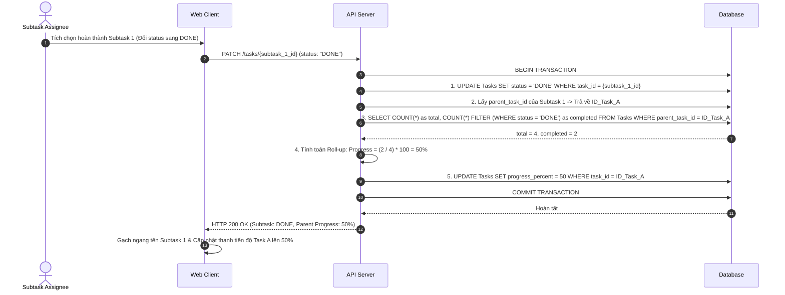

#### 5.3.4 Attempt to Complete Parent Task with Incomplete Subtasks (BL-PRJ-006.3)
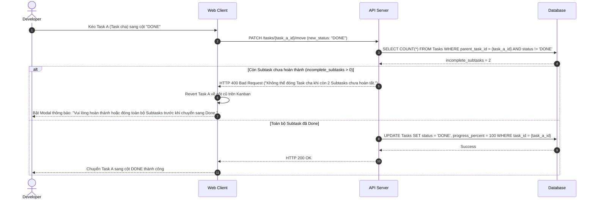

#### 5.3.5 Delete Subtask & Recalculate Roll-up
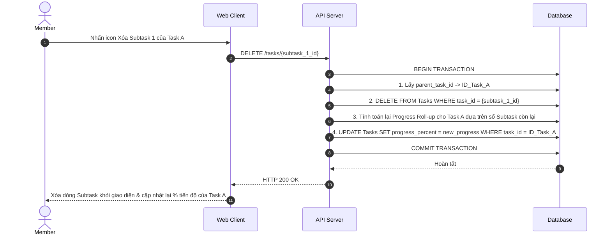

---

### 5.4 Project Lifecycle & Templates (FR-PRJ-018)

#### 5.4.1 Create Project from Template (Hạn mức BL-PRJ-018.1 & Sao chép BL-PRJ-018.2)
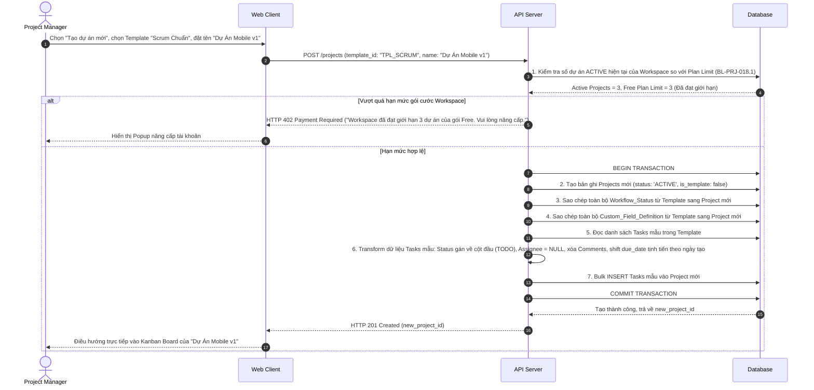

#### 5.4.2 Read / List Projects (Phân tách Active & Archived)
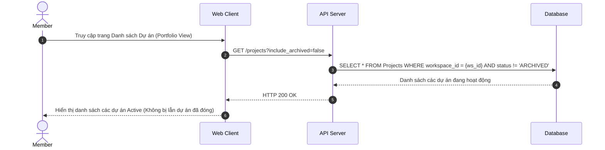

#### 5.4.3 Save Active Project as Template (FR-PRJ-018.3)
```mermaid
sequenceDiagram
    autonumber
    actor PM as Project Manager
    participant Client as Web Client
    participant API as API Server
    participant DB as Database

    PM->>Client: Bấm "Lưu thành Template", đặt tên "Mẫu Dự án Marketing 2026"
    Client->>API: POST /projects/{project_id}/save-as-template (template_name: "Mẫu Dự án Marketing 2026")
    API->>API: Kiểm tra quyền PM/Admin
    API->>DB: BEGIN TRANSACTION
    API->>DB: 1. Tạo bản ghi Project mới với is_template = true, status = 'ACTIVE'
    API->>DB: 2. Sao chép toàn bộ cấu hình Workflow và Custom Fields sang Template mới
    API->>DB: 3. Sao chép danh sách Tasks mẫu (đã xóa dữ liệu thực thi, lịch sử cá nhân)
    API->>DB: COMMIT TRANSACTION
    DB-->>API: Hoàn tất
    API-->>Client: HTTP 201 Created ("Lưu Template thành công")
    Client-->>PM: Template xuất hiện trong Thư viện Template của Workspace
```

#### 5.4.4 Archive Project (Đóng băng chỉ đọc BL-PRJ-018.3)
```mermaid
sequenceDiagram
    autonumber
    actor PM as Project Manager
    participant Client as Web Client
    participant API as API Server
    participant DB as Database

    PM->>Client: Nhấn chọn "Archive Project"
    Client->>Client: Hiển thị Modal xác nhận cảnh báo đóng băng dự án
    PM->>Client: Xác nhận Archive
    Client->>API: POST /projects/{project_id}/archive
    API->>API: Kiểm tra quyền PM
    API->>DB: UPDATE Projects SET status = 'ARCHIVED', updated_at = NOW() WHERE project_id = {id}
    DB-->>API: Success
    API-->>Client: HTTP 200 OK ("Dự án đã được lưu trữ")
    Client-->>PM: Đổi nhãn dự án thành "Archived (Read-only)", ẩn khỏi Sidebar và thanh điều hướng chính
```

#### 5.4.5 Unarchive Project (Khôi phục dự án FR-PRJ-018.5)
```mermaid
sequenceDiagram
    autonumber
    actor Admin as Workspace Admin
    participant Client as Web Client
    participant API as API Server
    participant DB as Database

    Admin->>Client: Vào mục Cài đặt -> Thùng lưu trữ dự án (Archived Projects) -> Bấm "Khôi phục"
    Client->>API: POST /projects/{project_id}/unarchive
    API->>API: Kiểm tra quyền Admin
    API->>DB: UPDATE Projects SET status = 'ACTIVE', updated_at = NOW() WHERE project_id = {id}
    DB-->>API: Success
    API-->>Client: HTTP 200 OK ("Khôi phục dự án thành công")
    Client-->>Admin: Dự án mở khóa quyền chỉnh sửa, xuất hiện trở lại trên Portfolio Dashboard
```

#### 5.4.6 Soft Delete Project
```mermaid
sequenceDiagram
    autonumber
    actor Admin as Workspace Admin
    participant Client as Web Client
    participant API as API Server
    participant DB as Database

    Admin->>Client: Bấm "Xóa vĩnh viễn/Xóa dự án"
    Client->>API: DELETE /projects/{project_id}
    API->>API: Kiểm tra quyền Workspace Admin
    API->>DB: UPDATE Projects SET is_deleted = true WHERE project_id = {id}
    DB-->>API: Success
    API-->>Client: HTTP 200 OK
    Client-->>Admin: Xóa hoàn toàn dự án khỏi giao diện người dùng
```

---

## 6. External Interface Requirements

### 6.1 User Interfaces (UI)
- **Kanban Board:** Kéo thả linh hoạt mượt mà, phản hồi màu sắc trạng thái (Xanh = Bình thường, Vàng = Gần chạm WIP, Đỏ = Đạt/Vượt trần WIP). Cảnh báo Icon tam giác đỏ nổi bật khi Task bị Blocked.
- **Task Detail Modal:** Bố cục linh hoạt tự động render các trường Custom Fields theo Type; kiểm tra định dạng tức thì trên Client (Client-side fast feedback) kết hợp Server-side validation.
- **Tree-view Table:** Hỗ trợ Expand/Collapse các Subtask mượt mà, hiển thị thanh tiến độ trực quan (% Progress Bar).

### 6.2 Software Interfaces
- **PostgreSQL Database:** Tối ưu hóa truy vấn EAV/JSONB qua extension `pg_trgm` hoặc GIN indexing trên trường JSONB.
- **WebSocket Gateway:** Giao tiếp kênh hai chiều thời gian thực để bắn các sự kiện: `TASK_MOVED`, `WIP_OVERRIDDEN`, `ASSIGNEE_HANDOFF`, `PROGRESS_UPDATED`.

---

## 7. Requirements Traceability Reference
Toàn bộ ma trận truy xuất từ Business Requirements -> Functional Requirements -> User Stories -> Test Cases đã được ánh xạ chi tiết và lưu trữ độc lập tại file [`03_RTM_PHASE2_OMNIPROJECT_CORE.csv`](./03_RTM_PHASE2_OMNIPROJECT_CORE.csv). Mọi thay đổi ở tài liệu này bắt buộc phải cập nhật đồng bộ sang RTM.
