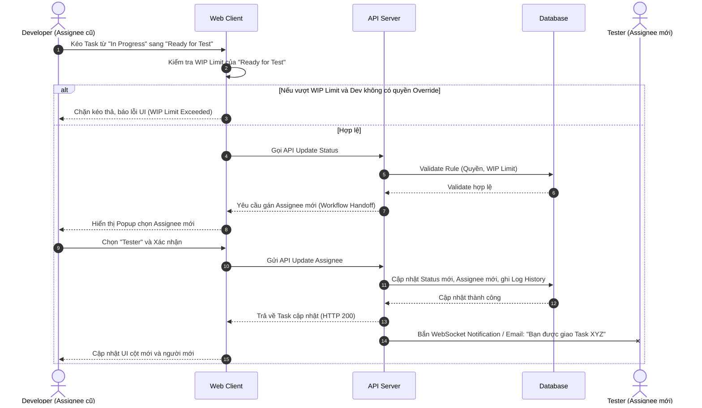

# Feature: Dynamic Workflows & WIP Limits (FR-PRJ-002)

**Mô tả:** Định nghĩa luồng trạng thái tùy chỉnh cho dự án, quy trình giao việc (Task Assignment) và kiểm soát khối lượng công việc đang xử lý (Work In Progress - WIP).

## 1. Functional Requirements List

| FR ID | Requirement Description | Input | Output | Associated Business Rule | Priority |
|---|---|---|---|---|---|
| **FR-PRJ-002.1** | **Định nghĩa Workflow (Custom Workflow):** Cho phép Project Manager tạo và cấu hình các trạng thái (Status) tùy chỉnh cho luồng công việc (VD: To Do -> Dev -> Test -> Done) và thiết lập giới hạn WIP cho từng trạng thái. | Form tạo/sửa Workflow, kéo thả thứ tự Status, cấu hình WIP Limit | Lưu Workflow vào hệ thống, áp dụng cho Project | BL-PRJ-002.3 | Must-have |
| **FR-PRJ-002.2** | **Quy trình Giao việc & Chuyển giao (Assignment & Handoff):** Khi chuyển Task sang một trạng thái mới (VD: từ Dev sang Test), hệ thống hỗ trợ tự động gợi ý/yêu cầu cập nhật người phụ trách (Assignee) phù hợp với vòng đời đó. | Hành động kéo thả Task sang cột trạng thái mới | Cập nhật Status và Assignee, gửi Notification cho Assignee mới | BL-PRJ-002.4 | Must-have |
| **FR-PRJ-002.3** | **Cảnh báo giới hạn WIP (WIP Block):** Hệ thống ngăn chặn hoặc cảnh báo khi kéo Task vào một trạng thái (Cột) đã đạt ngưỡng giới hạn WIP (Work In Progress). | Hành động kéo Task vào cột đạt WIP Limit | UI hiển thị cảnh báo đỏ, không cho Drop nếu không có quyền | BL-PRJ-002.1 | Must-have |
| **FR-PRJ-002.4** | **Vượt rào WIP (WIP Override):** Cấp quyền cho Project Manager (hoặc role được ủy quyền) xác nhận bỏ qua giới hạn WIP trong trường hợp khẩn cấp. | Xác nhận Override từ PM | Task được đưa vào cột thành công, cảnh báo đỏ vẫn lưu lại trên cột | BL-PRJ-002.2 | Should-have |

## 2. Business Rules

| BR ID | Rule Description | Applies to FR |
|---|---|---|
| **BL-PRJ-002.1** | **WIP Block:** Nếu cột trạng thái có giới hạn WIP = 3, khi một user (không phải PM) kéo Task thứ 4 vào, UI chặn hành động drop, tự động đẩy thẻ về cột cũ và hiển thị Toast/Alert cảnh báo màu Đỏ. | FR-PRJ-002.3 |
| **BL-PRJ-002.2** | **Override Privilege:** Chỉ Project Manager (hoặc Admin) mới có quyền "Override WIP Limit". Nếu Member kéo thả, hệ thống ném lỗi HTTP 403 Forbidden kèm thông báo không đủ quyền. | FR-PRJ-002.4 |
| **BL-PRJ-002.3** | **Workflow Integrity:** Không thể xóa một Status (Trạng thái) nếu đang có Task tồn tại bên trong nó. Phải di chuyển (Map) toàn bộ Task sang trạng thái khác trước khi xóa. | FR-PRJ-002.1 |
| **BL-PRJ-002.4** | **Handoff Notification:** Khi Assignee thay đổi do chuyển trạng thái, hệ thống tự động sinh thông báo In-app và Email cho Assignee mới, đồng thời ghi log vào Task History (Activity Stream). | FR-PRJ-002.2 |

## 3. Data Structure

### Entity: Workflow
| Field | Data Type | Required | Constraints |
|---|---|---|---|
| `workflow_id` | UUID | Yes | Primary Key |
| `name` | String | Yes | Tên luồng (VD: Scrum Default) |
| `project_id` | UUID | Yes | Foreign Key |

### Entity: Workflow_Status
| Field | Data Type | Required | Constraints |
|---|---|---|---|
| `status_id` | UUID | Yes | Primary Key |
| `workflow_id` | UUID | Yes | Foreign Key |
| `name` | String | Yes | VD: "In Progress", "Code Review" |
| `order_index` | Integer | Yes | Thứ tự hiển thị cột (0, 1, 2,...) |
| `wip_limit` | Integer | No | Số lượng Task tối đa (Null = Unlimited) |
| `category` | Enum | Yes | `TODO`, `IN_PROGRESS`, `DONE` |

## 4. Sequence Diagram: Task Assignment & Workflow Transition

Luồng xử lý khi người dùng chuyển trạng thái Task (giao việc qua các khâu):



## 5. Pre/Post-Conditions & Acceptance Criteria

### FR-PRJ-002.2: Giao việc qua trạng thái (Workflow Handoff)
- **Pre-condition:** Task đang ở trạng thái `IN_PROGRESS` (Dev đang làm).
- **Post-condition:** Task chuyển sang `TESTING`, người phụ trách được gán cho Tester.

**Gherkin Scenario:**
```gherkin
Given Task "Làm form đăng nhập" đang ở trạng thái "In Progress" do Developer "A" phụ trách
When Developer "A" kéo Task sang trạng thái "Testing"
Then hệ thống bật popup hỏi "Bạn muốn chuyển giao cho ai để Test?"
When Developer "A" chọn Tester "B" và bấm "Xác nhận"
Then Task chuyển sang cột "Testing"
And Assignee của Task đổi thành Tester "B"
And Tester "B" nhận được thông báo "Bạn được giao Task mới: Làm form đăng nhập"
```
