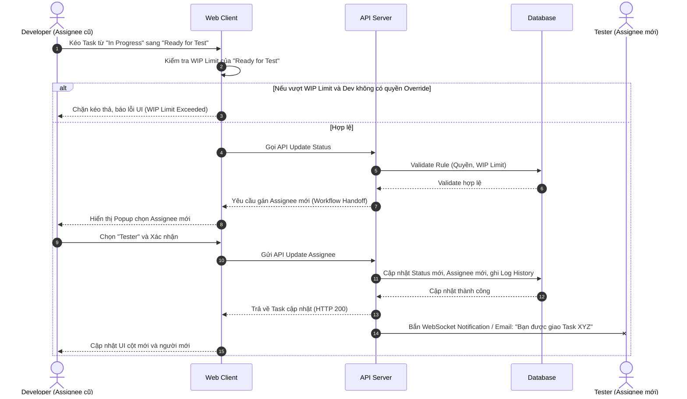

# Feature: Dynamic Workflows & WIP Limits (FR-PRJ-002)

**Mô tả:** Định nghĩa luồng trạng thái tùy chỉnh cho dự án, quy trình giao việc (Task Assignment) và kiểm soát khối lượng công việc đang xử lý (Work In Progress - WIP).

**Kiến trúc cốt lõi:** Áp dụng mô hình **Meta-Status Mapping** kết hợp **Task Flags** để hỗ trợ linh hoạt cả Kanban và **Scrumban (Kanban có Backlog)**.
- **Meta-Status Mapping (Tầng Tiến độ):** Cung cấp tập Meta-Status cố định (`OPEN`, `TODO`, `IN_PROGRESS`, `IN_REVIEW`, `DONE`, `CANCELED`). Các team được tạo vô số Custom Status tùy ý nhưng bắt buộc phải ánh xạ (map) vào 1 trong các Meta-Status. Dashboard báo cáo tổng công ty sẽ gom nhóm theo Meta-Status.
- **Vận hành Scrumban (Tách biệt Backlog & Board):** 
  - *Khởi tạo:* Khuyến nghị User tạo Status `Backlog` (Kho chứa ý tưởng) và map vào Meta-Status `OPEN`. UI sẽ hiển thị nhóm `OPEN` thành một danh sách (List View) bên ngoài bảng Kanban.
  - *Cam kết thực thi:* Cột `To Do` trên bảng Kanban thực tế sẽ được map vào Meta-Status `TODO`. Cứ mỗi chu kỳ (VD: 2 tuần), team họp và kéo Task từ Backlog sang To Do. Bảng Kanban chính chỉ chứa các công việc đã cam kết thực hiện.
- **Blocked Flag (Tầng Ngữ cảnh):** Xử lý các trạng thái kẹt/chờ bằng Cờ (Flag) trực tiếp trên Task thay vì tạo cột Status riêng. Khi bật cờ Blocked, Task giữ nguyên vị trí ở cột Status hiện tại nhưng UI sẽ hiển thị cảnh báo đỏ để quản lý chú ý.

## 1. Functional Requirements List

| FR ID | Requirement Description | Input | Output | Associated Business Rule | Priority |
|---|---|---|---|---|---|
| **FR-PRJ-002.1** | **Định nghĩa Workflow & Meta-Status Mapping:** Cho phép PM tạo và cấu hình các trạng thái tùy chỉnh (Custom Status) cho dự án. **Bắt buộc** phải ánh xạ (map) mỗi Custom Status vào một Meta-Status cốt lõi của hệ thống để phục vụ báo cáo liên phòng ban, đồng thời thiết lập WIP cho từng cột. | Form tạo Workflow, chọn Meta-Status, kéo thả thứ tự Status, cấu hình WIP Limit | Lưu Workflow và thông tin Mapping vào hệ thống | BL-PRJ-002.3 | Must-have |
| **FR-PRJ-002.2** | **Quy trình Giao việc & Chuyển giao (Assignment & Handoff):** Khi chuyển Task sang một trạng thái mới (VD: từ Dev sang Test), hệ thống hỗ trợ tự động gợi ý/yêu cầu cập nhật người phụ trách (Assignee) phù hợp với vòng đời đó. | Hành động kéo thả Task sang cột trạng thái mới | Cập nhật Status và Assignee, gửi Notification cho Assignee mới | BL-PRJ-002.4 | Must-have |
| **FR-PRJ-002.3** | **Cảnh báo giới hạn WIP (WIP Block):** Hệ thống ngăn chặn hoặc cảnh báo khi kéo Task vào một trạng thái (Cột) đã đạt ngưỡng giới hạn WIP (Work In Progress). | Hành động kéo Task vào cột đạt WIP Limit | UI hiển thị cảnh báo đỏ, không cho Drop nếu không có quyền | BL-PRJ-002.1 | Must-have |
| **FR-PRJ-002.4** | **Vượt rào WIP (WIP Override):** Cấp quyền cho Project Manager (hoặc role được ủy quyền) xác nhận bỏ qua giới hạn WIP trong trường hợp khẩn cấp. | Xác nhận Override từ PM | Task được đưa vào cột thành công, cảnh báo đỏ vẫn lưu lại trên cột | BL-PRJ-002.2 | Should-have |
| **FR-PRJ-002.5** | **Đánh dấu trở ngại (Blocked Flag):** Cho phép thành viên đánh dấu Task bị kẹt (Blocked) mà không cần đổi Status. Khi đánh dấu, yêu cầu nhập lý do và UI Task hiển thị cảnh báo. | Bấm nút "Mark as Blocked", nhập lý do | Cập nhật cờ `is_blocked=true`, hiển thị cờ trên Task card | BL-PRJ-002.5 | Must-have |

## 2. Business Rules

| BR ID | Rule Description | Applies to FR |
|---|---|---|
| **BL-PRJ-002.1** | **WIP Block:** Nếu cột trạng thái có giới hạn WIP = 3, khi một user (không phải PM) kéo Task thứ 4 vào, UI chặn hành động drop, tự động đẩy thẻ về cột cũ và hiển thị Toast/Alert cảnh báo màu Đỏ. | FR-PRJ-002.3 |
| **BL-PRJ-002.2** | **Override Privilege:** Chỉ Project Manager (hoặc Admin) mới có quyền "Override WIP Limit". Nếu Member kéo thả, hệ thống ném lỗi HTTP 403 Forbidden kèm thông báo không đủ quyền. | FR-PRJ-002.4 |
| **BL-PRJ-002.3** | **Workflow Integrity:** Không thể xóa một Status (Trạng thái) nếu đang có Task tồn tại bên trong nó. Phải di chuyển (Map) toàn bộ Task sang trạng thái khác trước khi xóa. | FR-PRJ-002.1 |
| **BL-PRJ-002.4** | **Handoff Notification:** Khi Assignee thay đổi do chuyển trạng thái, hệ thống tự động sinh thông báo In-app và Email cho Assignee mới, đồng thời ghi log vào Task History (Activity Stream). | FR-PRJ-002.2 |
| **BL-PRJ-002.5** | **Task Blocked State:** Khi Task bị đánh dấu Blocked, Task vẫn nằm ở cột hiện tại nhưng bị highlight đỏ/thêm icon cảnh báo để PM chú ý. Người dùng phải "Resolve Block" (gỡ cờ) trước khi kéo Task sang cột (Status) khác. | FR-PRJ-002.5 |

## 2.1. Chỉ số Đo lường Hiệu suất (Metrics Calculation)

Nhờ việc áp dụng kiến trúc Scrumban và Meta-Status (tách biệt Backlog là `OPEN` khỏi `TODO`), hệ thống tính toán các chỉ số quản trị tinh gọn (Lean Management) cực kỳ chuẩn xác:

* **Điểm cam kết (Commitment Point):** Là khoảnh khắc Task được gắp từ Backlog (`OPEN`) sang bảng Kanban thực thi (`TODO` hoặc `IN_PROGRESS`).
* **System Lead Time (Thời gian chờ tổng thể):** Tính từ lúc Task sinh ra (Created At) ở Backlog (`OPEN`) cho đến khi trạng thái chuyển sang `DONE`. Phản ánh tổng thời gian khách hàng phải đợi từ lúc yêu cầu đến lúc nhận thành quả.
* **Delivery Lead Time (Tốc độ giao hàng):** Tính từ **Điểm cam kết** (vào `TODO`) cho đến khi `DONE`. Đây là tốc độ thực thi thực tế của Team (loại trừ khoảng thời gian Task bị "ngâm" ở Backlog).
* **Cycle Time (Thời gian thao tác):** Tính từ lúc Task bắt đầu chuyển sang Meta-Status `IN_PROGRESS` cho đến khi `DONE`. Phản ánh thời gian thực sự mà nhân sự bỏ công sức ra làm việc.

## 3. Data Structure

### Entity: Workflow
| Field | Data Type | Required | Constraints |
|---|---|---|---|
| `workflow_id` | UUID | Yes | Primary Key |
| `name` | String | Yes | Tên luồng (VD: Scrum Default) |
| `project_id` | UUID | Yes | Foreign Key |

### Entity: Workflow_Status
| Field | Data Type | Required | Constraints |
|---|---|---|---|
| `status_id` | UUID | Yes | Primary Key |
| `workflow_id` | UUID | Yes | Foreign Key |
| `name` | String | Yes | Tên luồng hiển thị (VD: Nháp, Đang chạy, Chờ duyệt) |
| `order_index` | Integer | Yes | Thứ tự hiển thị cột (0, 1, 2,...) |
| `wip_limit` | Integer | No | Số lượng Task tối đa (Null = Unlimited) |
| `meta_category`| Enum | Yes | `OPEN`, `TODO`, `IN_PROGRESS`, `IN_REVIEW`, `DONE`, `CANCELED` |

### Entity: Task (Bổ sung thuộc tính Flags)
| Field | Data Type | Required | Constraints |
|---|---|---|---|
| `is_blocked` | Boolean | No | Đánh dấu Task đang bị kẹt (Mặc định: false) |
| `block_reason`| String | No | Lý do bị kẹt (Người dùng nhập khi bật cờ) |

## 4. Sequence Diagram: Task Assignment & Workflow Transition

Luồng xử lý khi người dùng chuyển trạng thái Task (giao việc qua các khâu):



## 5. Pre/Post-Conditions & Acceptance Criteria

### FR-PRJ-002.2: Giao việc qua trạng thái (Workflow Handoff)
- **Pre-condition:** Task đang ở trạng thái `IN_PROGRESS` (Dev đang làm).
- **Post-condition:** Task chuyển sang `TESTING`, người phụ trách được gán cho Tester.

**Gherkin Scenario:**
```gherkin
Given Task "Làm form đăng nhập" đang ở trạng thái "In Progress" do Developer "A" phụ trách
When Developer "A" kéo Task sang trạng thái "Testing"
Then hệ thống bật popup hỏi "Bạn muốn chuyển giao cho ai để Test?"
When Developer "A" chọn Tester "B" và bấm "Xác nhận"
Then Task chuyển sang cột "Testing"
And Assignee của Task đổi thành Tester "B"
And Tester "B" nhận được thông báo "Bạn được giao Task mới: Làm form đăng nhập"
```
