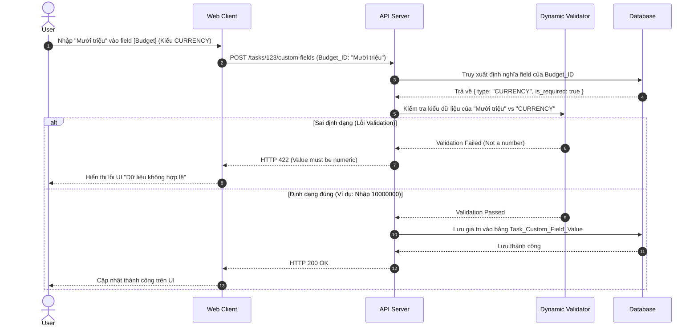

# Feature: Dynamic Custom Fields (FR-PRJ-004)

**Mô tả:** Hệ thống cho phép Project Manager linh hoạt định nghĩa các trường dữ liệu tùy chỉnh (Custom Fields) phù hợp với nghiệp vụ riêng của từng dự án mà không cần lập trình thêm.

## 1. Functional Requirements List

| FR ID | Requirement Description | Input | Output | Associated Business Rule | Priority |
|---|---|---|---|---|---|
| **FR-PRJ-004.1** | **Tạo Trường tùy chỉnh:** Cho phép định nghĩa Custom Field mới với các kiểu dữ liệu: `TEXT`, `NUMBER`, `CURRENCY`, `DATE`, `DROPDOWN`, `CHECKBOX`. | Tên trường, Kiểu dữ liệu, Tùy chọn (nếu có) | Lưu định nghĩa Field vào Project | BL-PRJ-004.1 | Must-have |
| **FR-PRJ-004.2** | **Quản lý giá trị Field:** Cho phép nhập và hiển thị giá trị của Custom Field trên UI của Task Modal, Kanban (trên thẻ Task), và Table View. | Giá trị nhập từ user | Lưu giá trị của field ứng với Task_ID | BL-PRJ-004.2 | Must-have |
| **FR-PRJ-004.3** | **Validation linh hoạt:** Project Manager có thể thiết lập cờ `Required`, `Min/Max` (với số), hoặc tập giá trị cho phép (Drop-down options). | Config Validation | Backend tự động xác thực giá trị truyền lên | BL-PRJ-004.1 | Should-have |
| **FR-PRJ-004.4** | **Lọc và Sắp xếp:** Người dùng có thể Filter (Lọc) và Sort (Sắp xếp) danh sách Task theo các Custom Field vừa tạo. | Thao tác trên thanh Filter | Danh sách Task được trả về theo điều kiện | BL-PRJ-004.3 | Should-have |

## 2. Business Logic & Rules

* **BL-PRJ-004.1 (Type Safety Enforcement):** Backend validate chặt chẽ `value` truyền lên dựa vào `type`. Nếu `type=CURRENCY`, `value` phải là kiểu số hoặc có format đúng; nếu sai ném lỗi `HTTP 422 Unprocessable Entity`.
* **BL-PRJ-004.2 (Soft Delete Field):** Khi xóa một Custom Field, dữ liệu cũ của các Task không bị mất ngay lập tức (chuyển sang trạng thái ẩn/archived). Người dùng vẫn có thể khôi phục Field này.
* **BL-PRJ-004.3 (Indexing cho Filter/Sort):** Các field tùy chỉnh có tần suất Filter/Sort cao (như Dropdown, Date) cần được lưu ở một cấu trúc dữ liệu dễ query (ví dụ: dùng bảng dọc EAV hoặc PostgreSQL JSONB index) để tối ưu hiệu năng tìm kiếm.

## 3. Data Structure (Mô hình Entity-Attribute-Value hoặc JSONB)

### Entity: Custom_Field_Definition
| Field | Data Type | Required | Constraints |
|---|---|---|---|
| `field_id` | UUID | Yes | Primary Key |
| `project_id` | UUID | Yes | Foreign Key |
| `name` | String | Yes | Tên hiển thị (VD: "Ngân sách", "Bản phát hành") |
| `type` | Enum | Yes | `TEXT`, `NUMBER`, `CURRENCY`, `DATE`, `DROPDOWN` |
| `options` | JSON | No | Dành cho Dropdown (VD: `["V1.0", "V2.0"]`) |
| `is_required` | Boolean | Yes | Bắt buộc nhập hay không |

### Entity: Task_Custom_Field_Value (Lưu trữ kiểu dọc - EAV)
| Field | Data Type | Required | Constraints |
|---|---|---|---|
| `task_id` | UUID | Yes | Foreign Key |
| `field_id` | UUID | Yes | Foreign Key |
| `value_string` | String | No | Lưu giá trị chuỗi/dropdown |
| `value_number` | Numeric | No | Lưu giá trị số/tiền tệ (để Sort/Filter) |
| `value_date` | Timestamp | No | Lưu giá trị ngày tháng |

*(Lưu ý: Có thể cân nhắc lưu dồn toàn bộ Custom Fields vào 1 trường `custom_fields` kiểu JSONB trong bảng Task nếu sử dụng PostgreSQL).*

## 4. Sequence Diagram: Validate Custom Field Value



## 5. Tiêu chí Chấp nhận (Acceptance Criteria)

**Là** Project Manager,
**Tôi muốn** tạo thêm một trường "Ngân sách (Budget)" kiểu Tiền tệ cho dự án,
**Để** quản lý chi phí từng đầu việc mà không cần nhờ đội IT sửa code hệ thống.

**Acceptance Criteria (Gherkin):**
```gherkin
Given tôi đang ở màn hình Cấu hình Dự án
When tôi chọn "Tạo Custom Field" và nhập tên "Ngân sách", chọn kiểu "Currency (VND)"
And tôi đánh dấu trường này là "Bắt buộc (Required)"
Then khi vào màn hình tạo Task mới, tôi sẽ thấy trường "Ngân sách" với dấu sao đỏ (*) bắt buộc nhập
And nếu tôi nhập chữ "abcd" vào trường Ngân sách và bấm Lưu
Then hệ thống sẽ báo lỗi "Vui lòng nhập giá trị số tiền hợp lệ"
```
