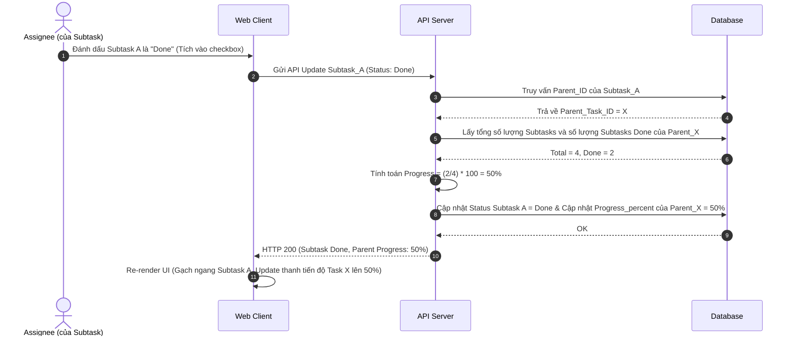

# Feature: Subtask Management (FR-PRJ-006)

**Mô tả:** Quản lý các công việc con (Subtasks) bên trong một Task lớn để chia nhỏ phạm vi công việc, gán cho nhiều người thực hiện khác nhau và theo dõi tiến độ tổng thể.

## 1. Functional Requirements List

| FR ID | Requirement Description | Input | Output | Associated Business Rule | Priority |
|---|---|---|---|---|---|
| **FR-PRJ-006.1** | **Tạo và Quản lý Subtask:** Cho phép người dùng tạo, sửa, xóa Subtask bên trong một Task. Subtask có thể được gán cho người khác (Assignee khác với Task cha) và có Deadline riêng. | Thông tin Subtask (Title, Assignee, Date) | Dữ liệu lưu vào hệ thống | BL-PRJ-006.2 | Must-have |
| **FR-PRJ-006.2** | **Cập nhật trạng thái Subtask:** Người thực thi có thể đánh dấu hoàn thành (Done) hoặc cập nhật trạng thái của Subtask độc lập với Task cha. | Hành động Click Checkbox / Đổi status | Trạng thái cập nhật, Log lịch sử | BL-PRJ-006.1 | Must-have |
| **FR-PRJ-006.3** | **Progress Roll-up (Cộng dồn tiến độ):** Hệ thống tự động tính toán tiến độ hoàn thành (%) của Task cha dựa trên số lượng Subtask đã Done. | Event hoàn thành Subtask | UI hiển thị Progress Bar (0-100%) | BL-PRJ-006.1 | Must-have |
| **FR-PRJ-006.4** | **Subtask View Mode:** Trên màn hình List/Table, người dùng có thể mở rộng (Expand) Task cha để xem danh sách Subtasks ở dạng cây (Tree-view). | Click nút Expand | Row UI hiển thị cấp con thụt lề | None | Should-have |

## 2. Business Logic & Rules

* **BL-PRJ-006.1 (Progress Roll-up Calculation):** Trạng thái hoàn thành của Task cha được tự động tính bằng phần trăm (%) số Subtask ở trạng thái `Done` chia cho tổng số Subtasks. `Progress = (Completed_Subtasks / Total_Subtasks) * 100`.
* **BL-PRJ-006.2 (Hierarchy Depth Limit):** Để tránh phức tạp hóa vòng đời và UI, chỉ cho phép tạo Subtask tối đa **1 cấp độ** (Parent -> Child). Không cho phép tạo Sub-subtask (Grandchild). Nếu đang ở cửa sổ Subtask, nút "Tạo Subtask" sẽ bị ẩn/disable.
* **BL-PRJ-006.3 (Parent-Child Constraint):** Không thể đánh dấu hoàn thành (Done) Task cha nếu vẫn còn Subtask ở trạng thái Incomplete. Hệ thống sẽ báo lỗi yêu cầu hoàn thành hoặc đóng các Subtask trước.

## 3. Data Structure

### Entity: Task (Mô hình Self-referencing)
| Field | Data Type | Required | Constraints |
|---|---|---|---|
| `task_id` | UUID | Yes | Primary Key |
| `parent_task_id` | UUID | No | Foreign Key (tham chiếu đến chính bảng `Task`). Nếu `Null` thì là Task gốc (Cấp 1). |
| `progress_percent`| Integer | No | Tính toán tự động, lưu cache từ 0 - 100. |

*(Lưu ý: Các trường khác như title, assignee_id... giống như Task thông thường).*

## 4. Sequence Diagram: Progress Roll-up & Parent Check



## 5. Tiêu chí Chấp nhận (Acceptance Criteria)

**Là** Developer,
**Tôi muốn** tạo các Subtask bên trong một Task lớn,
**Để** chia nhỏ công việc và dễ dàng theo dõi tiến độ từng phần.

**Acceptance Criteria (Gherkin):**
```gherkin
Given Task "Làm tính năng Login" đang có 4 Subtasks
When tôi check hoàn thành 2 Subtasks
Then thanh tiến độ (Progress bar) của Task cha tự động hiển thị "50%"

Given tôi đang xem chi tiết một Subtask (Cấp 2)
When tôi cố gắng tìm nút "Tạo Subtask" bên trong nó
Then nút đó sẽ bị ẩn đi để tuân thủ quy tắc 1 cấp độ
```
