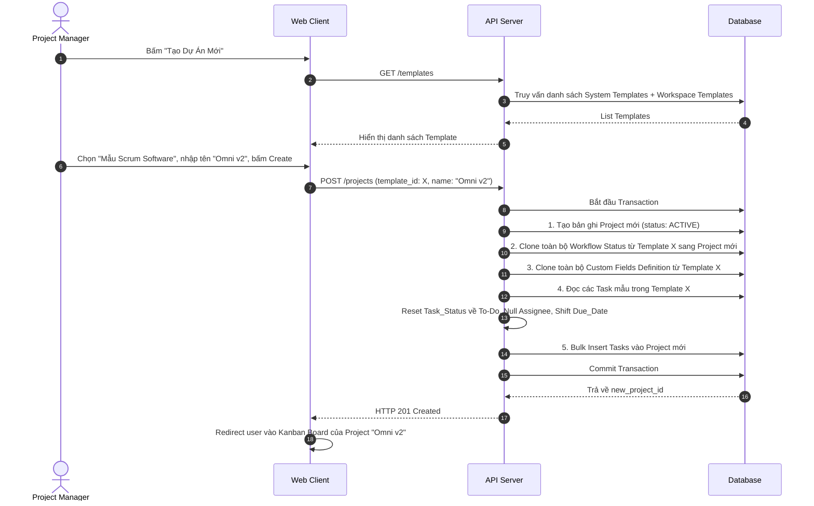

# Feature: Project Lifecycle & Templates (FR-PRJ-018)

**Mô tả:** Phân hệ quản lý toàn bộ vòng đời của một Dự án (Project) từ lúc khởi tạo (dựa trên Template hoặc tạo mới hoàn toàn), đến giai đoạn thực thi (Active), tạm dừng (Paused), và cuối cùng là đóng/lưu trữ (Closed/Archived). Tính năng Template giúp chuẩn hóa và tăng tốc quá trình thiết lập dự án cho doanh nghiệp.
**Priority:** P1 (High)

---

## 1. Functional Requirements List

| FR ID | Requirement Description | Input | Output | Associated Business Rule | Priority |
|---|---|---|---|---|---|
| **FR-PRJ-018.1** | **Tạo mới Project (Khởi tạo):** Cho phép Workspace Admin hoặc PM tạo dự án mới. Yêu cầu nhập Tên, Mô tả, Ngày bắt đầu/kết thúc dự kiến và gán Members ban đầu. | Form Create Project | Project ở trạng thái `ACTIVE` | BL-PRJ-018.1 | Must-have |
| **FR-PRJ-018.2** | **Sử dụng Project Templates:** Khi tạo Project, cung cấp danh sách Template (VD: "Mẫu Phát triển Phần mềm", "Mẫu Marketing Campaign"). Khi chọn, hệ thống tự động copy toàn bộ cấu trúc: Custom Workflow, Custom Fields, DoD config, và các Task mẫu. | Chọn Template | Project được tạo với data mồi | BL-PRJ-018.2 | Must-have |
| **FR-PRJ-018.3** | **Lưu Project thành Template:** Cho phép PM lưu lại một cấu trúc dự án đang chạy thành Template dùng chung cho toàn Workspace để tái sử dụng sau này. | Action "Save as Template" | Record lưu trong bảng Templates | BL-PRJ-018.2 | Should-have |
| **FR-PRJ-018.4** | **Archive / Đóng Project:** Khi dự án kết thúc, PM có thể chuyển trạng thái sang `ARCHIVED`. Dự án sẽ bị khóa `Read-only` và ẩn khỏi màn hình chính để không gây nhiễu. | Action "Archive Project" | Trạng thái chuyển thành ARCHIVED | BL-PRJ-018.3 | Must-have |
| **FR-PRJ-018.5** | **Khôi phục Project (Unarchive):** Cho phép Admin tìm lại các dự án đã Archive và mở lại (chuyển về `ACTIVE`) nếu có nhu cầu phát sinh. | Action "Unarchive" | Trạng thái chuyển thành ACTIVE | None | Must-have |

---

## 2. Business Logic & Rules

* **BL-PRJ-018.1 (Dung lượng Workspace):** Trước khi lưu Project mới vào DB, hệ thống phải check giới hạn của gói cước hiện tại (FR-ORG-001). Nếu gói Free đã đạt 3 Projects, chặn hành động và hiện popup yêu cầu Upgrade.
* **BL-PRJ-018.2 (Template Cloning Behavior):**
  * Khi clone từ Template, hệ thống sao chép: `Workflow Statuses`, `Custom Fields Definition`, `Project Settings` (như Scrum mode bật/tắt).
  * Đối với các Task mẫu trong Template: Chuyển toàn bộ status về cột đầu tiên (VD: To Do), xóa toàn bộ người được giao (Assignee = null), xóa toàn bộ comments, xóa actual_hours, ngày due_date được tịnh tiến theo ngày hiện tại.
* **BL-PRJ-018.3 (Archived Immutability):**
  * Project ở trạng thái `ARCHIVED` sẽ đóng băng toàn bộ. Không thể sửa, thêm, xóa bất kỳ Task hay Comment nào.
  * Các Task trong Archived Project sẽ **KHÔNG** xuất hiện trong các màn hình tổng hợp: "My Tasks", "Portfolio Dashboard", "Workload View", "Search" (Trừ khi user tick chọn "Include Archived").
  * Điều này đảm bảo hiệu năng database cho các query hằng ngày.

---

## 3. Data Structure

### Entity: Project (Cập nhật từ FR-010)
| Field | Data Type | Required | Constraints |
|---|---|---|---|
| `project_id` | UUID | Yes | Primary Key |
| `workspace_id` | UUID | Yes | Foreign Key |
| `name` | String | Yes | |
| `status` | Enum | Yes | `ACTIVE`, `PAUSED`, `ARCHIVED` |
| `is_template` | Boolean | Yes | Mặc định `false`. Nếu `true`, nó là Template gốc |

*(Lưu ý: System Templates do đội ngũ OmniProject cung cấp sẽ có `workspace_id` = null hoặc một ID đặc biệt của hệ thống, để tất cả Workspace đều có thể đọc/clone).*

### Entity: Project_Member
| Field | Data Type | Required | Constraints |
|---|---|---|---|
| `project_id` | UUID | Yes | Mối quan hệ N-N |
| `user_id` | UUID | Yes | |
| `role_in_project` | Enum | Yes | `PROJECT_MANAGER`, `MEMBER`, `OBSERVER` |

---

## 4. Sequence Diagram: Clone Project từ Template



---

## 5. Tiêu chí Chấp nhận (Acceptance Criteria)

**Là** Project Manager,
**Tôi muốn** có thể sao chép toàn bộ một quy trình chuẩn từ Template,
**Để** không phải mất hàng giờ thiết lập các cột trạng thái (Status) và các trường tùy chỉnh (Custom Fields) từ đầu mỗi khi có dự án mới.

**Acceptance Criteria (Gherkin):**
```gherkin
Given hệ thống đang có một Template tên "Chiến dịch Marketing" chứa sẵn 5 Cột trạng thái và 10 Task mẫu
When tôi tạo dự án mới và chọn sử dụng Template này
Then hệ thống sẽ mất vài giây để xử lý
And dự án mới được tạo ra có cấu trúc cột giống hệt Template
And 10 Task mẫu xuất hiện ở cột đầu tiên, tất cả đều chưa có người phụ trách (Unassigned)

Given dự án "Marketing Q3" đã kết thúc
When tôi chọn hành động "Archive Project"
Then dự án biến mất khỏi Sidebar và màn hình Portfolio
And mọi hành động tạo, sửa, xóa Task trong dự án đó đều bị vô hiệu hóa (Read-only)
And các Task của dự án đó không còn hiển thị ở màn hình "My Tasks" của nhân viên nữa
```
