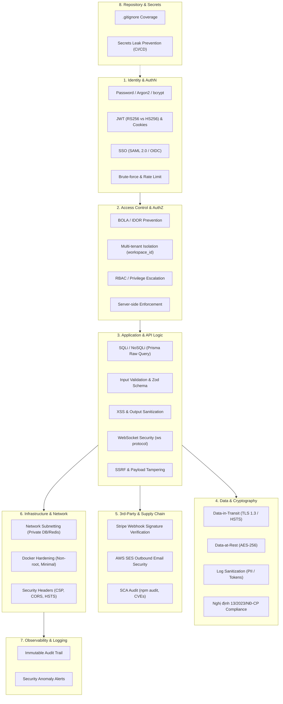

# Kế Hoạch Rà Soát Lỗi Bảo Mật Hệ Thống (System Security Audit Plan)

> **Phiên bản:** 1.0  
> **Ngày lập:** 21-09-2026  
> **Phạm vi:** Toàn bộ hệ sinh thái OmniProject Core (`backend_otm`, `frontend_otm`, `omnimer_team_doc`, hạ tầng cloud/database/cache).  
> **Tiêu chuẩn tham chiếu:** OWASP Top 10 (2021), OWASP API Security Top 10 (2023), OWASP ASVS v4.0, NIST SP 800-53, CIS Benchmarks, STRIDE/DREAD Threat Modeling, PCI-DSS v4.0, Nghị định 13/2023/NĐ-CP (Bảo vệ dữ liệu cá nhân).

---

## I. Các Phân Vùng Bảo Mật Cần Rà Soát Theo Tiêu Chuẩn (Security Domains)

Theo mô hình **Phòng thủ chiều sâu (Defense-in-Depth)** và các tiêu chuẩn bảo mật quốc tế, hệ thống được phân rã thành 8 phân vùng cốt lõi cần rà soát:



### 1. Phân vùng 1: Xác thực & Quản lý Danh tính (Authentication & Identity - AuthN)
- **Tiêu chuẩn:** OWASP ASVS V2 & V3, NIST SP 800-63B.
- **Hạng mục rà soát:**
  - Thuật toán hash mật khẩu: Sử dụng `argon2id` hoặc `bcrypt` (work factor $\ge 12$). Nghiêm cấm MD5, SHA-1, SHA-256 thô.
  - Cơ chế JWT: Kiểm tra thuật toán ký (RS256 khuyến nghị, cấm `alg: none` hoặc nhầm lẫn khóa giữa RSA công khai và HMAC đối xứng). Thời gian sống token (`exp`), cơ chế Refresh Token Rotation và thu hồi phiên (Revocation / Blacklist trên Redis).
  - Cookie Security: Lưu session/token trong cookie gắn cờ `httpOnly`, `Secure`, `SameSite=Strict/Lax`.
  - Xác thực SSO (SAML 2.0 & OIDC qua Passport.js): Xác thực chữ ký XML/SAML Assertion, kiểm tra `redirect_uri` whitelist, phòng chống Replay Attack (nonce/timestamp check).
  - Phòng chống Brute-force: Rate limit trên các endpoint `/api/v1/auth/login`, `/register`, `/forgot-password`.

### 2. Phân vùng 2: Phân quyền & Cô lập Dữ liệu (Authorization & Multi-Tenancy - AuthZ)
- **Tiêu chuẩn:** OWASP Top 10 (A01: Broken Access Control), OWASP API Security Top 10 (API1: BOLA, API5: BFLA).
- **Hạng mục rà soát:**
  - **BOLA / IDOR (Broken Object Level Authorization):** Mọi request chứa `projectId`, `groupId`, `memberId`, `taskId` đều phải được backend kiểm tra xem đối tượng có thuộc về `workspace_id` của user hiện tại hay không.
  - **Multi-tenant Data Leakage:** Bắt buộc áp dụng bộ lọc `workspace_id` trong mọi truy vấn Prisma ORM / SQL; kiểm tra khả năng cấu hình PostgreSQL Row-Level Security (RLS) để cô lập tầng DB.
  - **Kiểm soát leo thang đặc quyền (Privilege Escalation):** Ngăn chặn người dùng sửa đổi role của chính mình thành `SUPER_ADMIN` hoặc `OWNER` thông qua Mass Assignment.
  - **RBAC Server-side Enforcement:** Toàn bộ logic kiểm tra quyền (Permission Guard) phải nằm tại Middleware của Express.js, không tin cậy trạng thái phân quyền gửi từ client Next.js.

### 3. Phân vùng 3: Tầng Ứng dụng & API Logic (Application & API Security - AppSec)
- **Tiêu chuẩn:** OWASP Top 10 (A03: Injection, A04: Insecure Design, A08: Software & Data Integrity).
- **Hạng mục rà soát:**
  - **SQL / NoSQL Injection:** Rà soát toàn bộ các câu lệnh Prisma `$queryRaw` hoặc truy vấn ghép chuỗi (string concatenation) nếu có.
  - **Schema Validation:** Xác thực chặt chẽ đầu vào bằng Zod/Joi schema (whitelist-first). Loại bỏ triệt để payload dư thừa nhằm tránh Mass Assignment.
  - **XSS & Output Escaping:** Đảm bảo dữ liệu từ người dùng (rich text, task description) được render an toàn trong React/Next.js (không dùng `dangerouslySetInnerHTML` tùy tiện mà không qua DOMPurify).
  - **WebSocket Security (`ws`):** Xác thực vé phiên (ticket-based / handshake auth), giới hạn số lượng kết nối đồng thời trên mỗi IP/User, validate định dạng message gửi lên và phân vùng kênh (channel isolation) theo workspace.
  - **SSRF (Server-Side Request Forgery):** Rà soát các endpoint tải tài nguyên ngoại vi (URL fetcher, avatar downloader, webhook forwarder). Bắt buộc chặn các dải IP riêng tư (Private IP: `10.0.0.0/8`, `192.168.0.0/16`, `127.0.0.1`) và metadata endpoints (`169.254.169.254`).
  - **Optimistic Concurrency Control (OCC):** Đảm bảo cơ chế versioning (`version`) xử lý đúng điều kiện tranh chấp (Race Condition) và trả về HTTP 412 khi có xung đột dữ liệu.

### 4. Phân vùng 4: Bảo vệ Dữ liệu & Mật mã học (Data Protection & Cryptography)
- **Tiêu chuẩn:** OWASP ASVS V6, PCI-DSS Requirement 3 & 4, Nghị định 13/2023/NĐ-CP.
- **Hạng mục rà soát:**
  - **Dữ liệu truyền tải (Data-in-Transit):** Bắt buộc TLS 1.2+ (khuyến nghị TLS 1.3), bật HSTS (`Strict-Transport-Security`).
  - **Dữ liệu lưu trữ (Data-at-Rest):** Mã hóa AES-256 các trường nhạy cảm (API keys, SSO client secrets, Stripe customer IDs). Mã hóa các bản sao lưu (database backups).
  - **Vệ sinh Log (Log Sanitization):** Loại bỏ mật khẩu, JWT token, số thẻ, PII (Email cá nhân, số điện thoại) khỏi hệ thống log console/file.
  - **Data Retention & Soft-deactivation:** Rà soát quy trình vô hiệu hóa thành viên (Member Deactivation), ẩn thông tin cá nhân theo yêu cầu quyền được quên (Right to be Forgotten).

### 5. Phân vùng 5: Tích hợp Bên thứ ba & Chuỗi cung ứng (Third-Party & Supply Chain)
- **Tiêu chuẩn:** OWASP Top 10 (A06: Vulnerable and Outdated Components), Stripe Security Best Practices.
- **Hạng mục rà soát:**
  - **Stripe Webhook:** Bắt buộc xác thực chữ ký số `stripe-signature` với Raw Request Body và `STRIPE_WEBHOOK_SECRET`. Kiểm tra cơ chế chống tấn công lặp lại (Replay Attack) bằng timestamp tolerance.
  - **Dịch vụ gửi Email (AWS SES):** Kiểm tra chống Header Injection khi tạo email template; giới hạn tỷ lệ gửi email để tránh bị biến thành máy chủ spam.
  - **Phân tích phụ thuộc (SCA):** Rà soát toàn bộ thư viện trong `package.json` bằng `npm audit`, Snyk, hoặc GitHub Dependabot nhằm phát hiện CVE đã biết.

### 6. Phân vùng 6: Hạ tầng, Container & Mạng (Infrastructure & Network Security)
- **Tiêu chuẩn:** CIS Docker Benchmark, CIS PostgreSQL Benchmark.
- **Hạng mục rà soát:**
  - **Phân đoạn mạng (Network Segmentation):** PostgreSQL và Redis tuyệt đối không mở cổng `5432` / `6379` ra Public Internet; chỉ chấp nhận kết nối từ mạng nội bộ (VPC/Subnet riêng) của backend.
  - **Docker Hardening:** Cấu hình container chạy dưới user phi đặc quyền (`USER node` thay vì `root`), sử dụng base image tối giản (Alpine / Distroless), kiểm tra quét lỗ hổng image trước khi deploy.
  - **Security Headers & CORS:** Thiết lập nghiêm ngặt CORS (chỉ chấp nhận domain frontend hợp lệ, cấm `*` khi đi kèm `credentials: true`), tích hợp đầy đủ các HTTP Security Headers (`Content-Security-Policy`, `X-Frame-Options: DENY`, `X-Content-Type-Options: nosniff`).

### 7. Phân vùng 7: Ghi log Kiểm toán & Ứng phó Sự cố (Audit Logging & Monitoring)
- **Tiêu chuẩn:** OWASP Top 10 (A09: Security Logging and Monitoring Failures), ISO 27001 A.12.4.
- **Hạng mục rà soát:**
  - **Audit Trail:** Ghi nhận đầy đủ thông tin (Actor ID, IP, User-Agent, Action, Target ID, Timestamp) cho các hành động quan trọng (đổi vai trò, xóa thành viên, cập nhật cấu hình workspace, thay đổi gói thanh toán).
  - **Phát hiện bất thường:** Giám sát và cảnh báo tự động khi xuất hiện đột biến lỗi HTTP 401/403, lỗi xác thực webhook liên tiếp, hoặc dấu hiệu dò quét endpoint.

### 8. Phân vùng 8: Vệ sinh Kho mã nguồn & Quản trị Secret (Repository & Secret Hygiene)
- **Tiêu chuẩn:** Git Secret Leak Prevention Guidelines.
- **Hạng mục rà soát:**
  - Đảm bảo file `.gitignore` bao phủ đầy đủ các định dạng file nhạy cảm (`.env`, `*.pem`, `*.key`, `secrets.*`, `credentials.*`).
  - Quét lịch sử Git commit để đảm bảo không có API key hay thông tin xác thực nào từng bị commit vào repository trong quá khứ.

---

## II. Kế Hoạch Rà Soát Chi Tiết (5-Phase Execution Plan)

```
┌──────────────────────────────────────────────────────────────────────────────────┐
│                             SECURITY AUDIT WORKFLOW                              │
├─────────────────┬─────────────────┬─────────────────┬─────────────────┬──────────┤
│ Phase 1         │ Phase 2         │ Phase 3         │ Phase 4         │ Phase 5  │
│ Scoping &       │ Automated Scan  │ Manual AppSec & │ Infra & Network │ Report & │
│ Threat Model    │ (SAST/SCA/Git)  │ Business Logic  │ Configuration   │ Fix Plan │
└─────────────────┴─────────────────┴─────────────────┴─────────────────┴──────────┘
```

### Giai đoạn 1: Xác định phạm vi & Mô hình hóa hiểm họa (Scoping & STRIDE Modeling)
- **Mục tiêu:** Định vị toàn bộ ranh giới tin cậy (Trust Boundaries), luồng dữ liệu (Data Flows) và các tài nguyên trọng yếu của OmniProject.
- **Công việc cụ thể:**
  1. Phỏng vấn và rà soát tài liệu kiến trúc (`c4_model_phase1.md`, `erd_project_core.md`, `tech_stack.md`).
  2. Lập bảng phân tích STRIDE (Spoofing, Tampering, Repudiation, Information Disclosure, Denial of Service, Elevation of Privilege) cho 4 luồng dữ liệu cốt lõi:
     - Luồng Xác thực người dùng (Auth & SSO Flow)
     - Luồng Phân quyền Workspace & Multi-tenancy
     - Luồng Đồng bộ dữ liệu qua WebSocket
     - Luồng Xử lý Webhook thanh toán Stripe
- **Thời lượng ước tính:** 1 - 2 ngày làm việc.

### Giai đoạn 2: Quét tự động & Vệ sinh kho mã (Automated Scanning: SAST, SCA, Secrets)
- **Mục tiêu:** Phát hiện nhanh các lỗ hổng đã biết, thư viện lỗi thời, và secret bị rò rỉ bằng công cụ tự động.
- **Công việc cụ thể:**
  1. **Kiểm tra `.gitignore` & Quét Secret:**
     ```bash
     python3 .agents/skills/security/scripts/gitignore_checker.py --dir /Users/macbookair/Downloads/omnimer_team/backend_otm/project_core
     ```
  2. **Quét mã nguồn tĩnh (SAST):**
     ```bash
     python3 .agents/skills/security/scripts/general_security_scanner.py --dir /Users/macbookair/Downloads/omnimer_team/backend_otm/project_core/src --severity medium
     ```
  3. **Kiểm tra lỗ hổng phụ thuộc (SCA):**
     ```bash
     cd /Users/macbookair/Downloads/omnimer_team/backend_otm/project_core && npm audit --audit-level=high
     ```
  4. Triệt tiêu các kết quả dương tính giả (False Positives) trong các file test fixtures.
- **Thời lượng ước tính:** 1 ngày làm việc.

### Giai đoạn 3: Rà soát thủ công chuyên sâu Tầng Ứng dụng & Nghiệp vụ (Manual Deep-Dive)
- **Mục tiêu:** Tìm kiếm các lỗi logic nghiệp vụ mà công cụ tự động không thể quét được (BOLA, Privilege Escalation, Race Conditions).
- **Công việc cụ thể:**
  1. **Kiểm toán BOLA / IDOR:** Kiểm tra từng API Controller/Service xem có query trực tiếp bằng ID mà quên nối điều kiện `workspace_id` hay không.
  2. **Kiểm toán phân quyền RBAC:** Thử nghiệm gọi chéo API giữa các vai trò (Owner vs Admin vs Member vs Guest).
  3. **Kiểm toán Stripe Webhook:** Xác thực đoạn code xử lý chữ ký Stripe (`constructEvent`), kiểm tra xử lý trùng lặp sự kiện (Idempotency Key).
  4. **Kiểm toán WebSocket Pub/Sub:** Rà soát hàm broadcast sự kiện trong `ws` xem có trường hợp gửi nhầm message sang workspace khác hay không.
  5. **Kiểm toán OCC Concurrency:** Thử nghiệm kịch bản 2 request cập nhật cùng một Task với phiên bản version cũ để xác nhận việc ném HTTP 412.
- **Thời lượng ước tính:** 3 - 4 ngày làm việc.

### Giai đoạn 4: Đánh giá Cấu hình Hạ tầng & Môi trường (Infra & Env Review)
- **Mục tiêu:** Đảm bảo môi trường triển khai (Docker, PostgreSQL, Redis, Cloud) được thiết lập an toàn.
- **Công việc cụ thể:**
  1. Rà soát file `docker-compose.yml` và Dockerfile: Kiểm tra quyền user chạy container, cổng mạng public.
  2. Kiểm tra chuỗi kết nối Database và Redis: Đảm bảo sử dụng tài khoản có quyền tối thiểu (Least Privilege), không dùng user `postgres` root cho ứng dụng.
  3. Rà soát cấu hình CORS, CSP và các Header bảo mật trong middleware Express.
- **Thời lượng ước tính:** 1 - 2 ngày làm việc.

### Giai đoạn 5: Tổng hợp Báo cáo, Chấm điểm Rủi ro (DREAD/CVSS) & Lập Kế hoạch Khắc phục
- **Mục tiêu:** Xuất báo cáo lỗ hổng chi tiết và danh sách nhiệm vụ ưu tiên xử lý (Remediation Backlog).
- **Công việc cụ thể:**
  1. Phân loại mức độ nghiêm trọng theo thang điểm DREAD (Damage, Reproducibility, Exploitability, Affected Users, Discoverability).
  2. Lập báo cáo lỗ hổng theo mẫu chuẩn `resources/template_vulnerability_report.md`.
  3. Tổ chức buổi bàn giao và phân bổ ticket khắc phục cho đội ngũ phát triển (Bắt buộc xử lý toàn bộ lỗi Critical và High trước khi ra bản Release).
- **Thời lượng ước tính:** 1 ngày làm việc.

---

## III. Bảng Nhận Diện Rủi Ro & Tình Huống Biên Đặc Thù (Risks & Edge Cases)

| Mã | Hạng mục | Tình huống nguy cơ (Risk / Edge Case) | Tác động | Giải pháp phòng thủ chuẩn hóa |
|:---|:---|:---|:---|:---|
| **RSK-01** | Multi-Tenancy | Người dùng Workspace A thay đổi ID trên URL để truy cập tài nguyên của Workspace B (BOLA/IDOR). | Rò rỉ dữ liệu doanh nghiệp giữa các khách hàng (Critical). | Bắt buộc middleware trích xuất `workspace_id` từ Token/Session và nhúng làm filter cứng trong Prisma query. |
| **RSK-02** | Stripe Webhook | Kẻ tấn công giả mạo gọi vào endpoint webhook thanh toán để kích hoạt gói cước mà không trả tiền. | Thất thoát tài chính & gian lận dịch vụ (Critical). | Bắt buộc kiểm tra chữ ký `stripe-signature` với Raw Body và Webhook Secret của Stripe. |
| **RSK-03** | WebSocket Leaks | Message cập nhật thời gian thực được broadcast ra toàn server thay vì chỉ gửi cho các client trong cùng một `workspace_id`. | Rò rỉ tin nhắn, trạng thái task của công ty này sang công ty khác (High). | Tổ chức WebSocket client theo Room/Workspace ID, cô lập kênh truyền tin tại tầng Redis Pub/Sub. |
| **RSK-04** | Mass Assignment | Request cập nhật thông tin cá nhân gửi kèm `role: "SUPER_ADMIN"` hoặc `isOwner: true`. | Leo thang đặc quyền trái phép (High). | Sử dụng Zod schema định nghĩa danh sách whitelist các trường cho phép cập nhật, loại bỏ các trường hệ thống. |
| **RSK-05** | Race Condition | Hai người dùng đồng thời chỉnh sửa trạng thái một task hoặc phân bổ thành viên. | Xung đột dữ liệu, ghi đè mất mát lịch sử công việc (Medium). | Áp dụng triệt để Optimistic Concurrency Control (OCC) qua trường `version`, trả mã lỗi HTTP 412 khi xung đột. |
| **RSK-06** | Secret Exposure | Lộ file `.env` hoặc file khóa `.pem` do cấu hình `.gitignore` chưa bao quát hết định dạng. | Chiếm đoạt quyền truy cập cơ sở dữ liệu hoặc tài khoản cloud (Critical). | Cập nhật `.gitignore` theo khuyến nghị của `gitignore_checker.py`, tích hợp pre-commit hooks chặn commit secret. |

---

## IV. Tiêu Chí Nghiệm Thu Đánh Giá Bảo Mật (Definition of Done - DoD)
1. **Zero Critical & Zero High:** Không còn bất kỳ lỗ hổng mức Critical hoặc High nào tồn tại trên nhánh triển khai Production.
2. **Automated Gate Passed:** Các công cụ quét tự động (`gitignore_checker`, `general_security_scanner`, `npm audit`) hoàn thành với 0 cảnh báo nghiêm trọng trong CI/CD.
3. **Multi-tenant Isolation Verified:** Toàn bộ các bộ test tích hợp BOLA/IDOR và Cross-tenant Authorization chạy thành công 100%.
4. **Audit Trail Functional:** Các thao tác quản trị viên đều được ghi vết đầy đủ vào bảng sự kiện kiểm toán bất biến.
